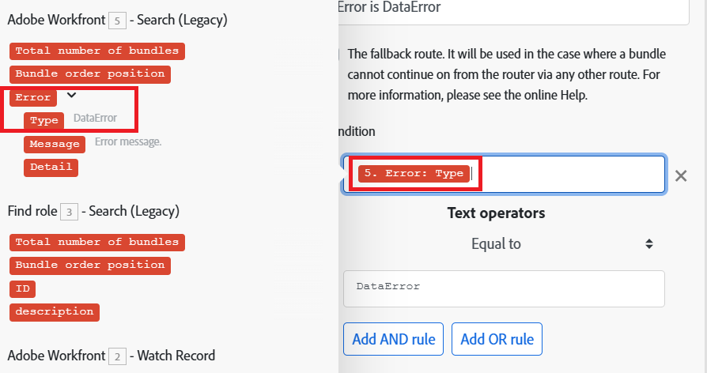
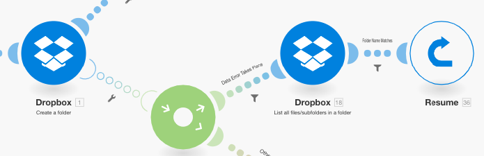

# Adicionar filtragem e aninhamento a rotas de tratamento de erros

É possível adicionar técnicas avançadas de tratamento de erros à sua rota de tratamento de erros, incluindo filtragem e aninhamento.

## Requisitos de acesso

+++ Expanda para visualizar os requisitos de acesso para a funcionalidade neste artigo.

<table style="table-layout:auto">
 <col> 
 <col> 
 <tbody> 
  <tr> 
   <td role="rowheader">Pacote do Adobe Workfront</td> 
   <td> 
Qualquer pacote de fluxo de trabalho do Adobe Workfront e qualquer pacote de Automação e Integração do Adobe Workfront

Workfront Ultimate

Workfront Prime e pacotes Select, com uma compra adicional do Workfront Fusion.
 </td> 
  </tr> 
  <tr data-mc-conditions=""> 
   <td role="rowheader">Licenças do Adobe Workfront</td> 
   <td> 
Standard

Trabalhar ou superior
 </td> 
  </tr> 
  <tr> 
   <td role="rowheader">Produto</td> 
   <td>
   
Se sua organização tiver um pacote Select ou Prime Workfront que não inclua a Automação e Integração do Workfront, ela deverá comprar o Adobe Workfront Fusion.</li></ul>
   </td> 
  </tr>
 </tbody> 
</table>

Para obter mais detalhes sobre as informações nesta tabela, consulte [Requisitos de acesso na documentação](/help/workfront-fusion/references/licenses-and-roles/access-level-requirements-in-documentation.md).

+++

## Filtragem

Há dois tipos de filtragem que podem ocorrer em uma rota de manipulador de erros.

* [Adicionar um filtro à rota do manipulador de erros](#add-a-filter-to-the-error-handler-route)
* [Adicionar um roteador seguido de filtros à rota do manipulador de erros](#add-a-router-followed-by-filters-to-the-error-handler)

### Adicionar um filtro à rota do manipulador de erros

Você pode usar um filtro para controlar quais erros são manipulados pela rota do manipulador de erros. Isso permite processar apenas tipos específicos de erros. Se um erro não passar pelo filtro, ele será tratado como se não houvesse nenhuma rota de manipulador de erros definida para o módulo fornecido.

Esses filtros são configurados como qualquer outro filtro no Fusion. Para obter instruções, consulte [Adicionar um filtro a um cenário](/help/workfront-fusion/create-scenarios/add-modules/add-a-filter-to-a-scenario.md).

### Adicionar um roteador seguido de filtros ao manipulador de erros

Adicionar um roteador a uma rota de tratamento de erros permite configurar rotas diferentes para tipos diferentes de erros.

Por exemplo, para configurar uma rota para ser executada quando o erro for um DataError, é possível configurar um filtro que permita a passagem de dados se o tipo de erro mapeado for igual a DataError.

Para obter informações sobre como o Fusion avalia e processa vários tipos de dados, consulte [Tipos de erro](/help/workfront-fusion/references/errors/error-processing.md).

### Exemplo: tratamento de erros com filtros

>[!BEGINSHADEBOX]

Este exemplo de cenário mostra como esses filtros funcionam para a manipulação de erros.

Se você usar o módulo Dropbox > Criar uma pasta e uma pasta com o mesmo nome já existir, o módulo emitirá um DataError:

O cenário completo funciona da seguinte maneira:

1. O módulo Ferramentas > Definir variável contém o nome da pasta
1. O módulo HTTP > Obter um arquivo busca o arquivo que precisa ser carregado na pasta
1. O módulo Dropbox > Criar uma pasta emitirá um erro se uma pasta já existir com o mesmo nome que a mapeada no módulo
1. A rota do manipulador de erros (bolhas transparentes) contém um roteador para filtrar os erros
A primeira rota é para um tipo de erro especificado chamado `DataError`.

   1. Se um `DataError` ocorrer e os detalhes do erro passarem pelo filtro, o Dropbox > Listar todos os arquivos/subpastas em um módulo de pasta listará todas as pastas no Dropbox.
   1. O filtro subsequente corresponde aos nomes da pasta.
   1. A diretiva **Resume** especifica a ID da pasta e o caminho da pasta existente, e a execução do cenário é retomada a partir do módulo Dropbox > Criar uma pasta. No entanto, em vez de criar uma nova pasta, o Fusion usa os valores da diretiva Retomar para mover para o próximo módulo e fazer upload do arquivo na pasta existente.

1. A segunda rota é para todos os outros erros e termina com a diretiva Rollback, que resulta na interrupção imediata do cenário

Veja abaixo uma explicação detalhada da rota DataError.

Para usar a pasta existente em seus módulos subsequentes, como Fazer upload de um arquivo, você deve adicionar uma rota de manipulador de erros ao módulo e buscar o caminho da pasta a ser mapeado no módulo de diretiva Retomar que se segue:

O filtro na primeira rota é definido para lidar apenas com o erro específico (DataError) que aparece quando uma pasta com o mesmo nome já existe:

O módulo Dropbox > Listar todos os arquivos em uma pasta é configurado para retornar todas as pastas na pasta de destino. O filtro a seguir passa apenas aquele que estávamos tentando criar originalmente. (O nome da pasta é armazenado no 33. Nome da pasta (item.)

A diretiva Retomar fornece o caminho da pasta como saída para o módulo com falha. Observe que a ID da pasta foi deixada em branco, pois não é necessária para o módulo Fazer upload de um arquivo.

>[!ENDSHADEBOX]

## Aninhamento

As rotas do manipulador de erros podem ser criadas e configuradas em todos os módulos, exceto roteadores. Portanto, você pode criar uma rota de manipulador de erros para um módulo que já faz parte de uma rota de manipulador de erros existente.

>[!BEGINSHADEBOX]

Exemplo:

Uma rota de manipulador de erros aninhada com filtros:

Nesse cenário, a segunda rota do manipulador de erros é aninhada na primeira rota do manipulador de erros.

Se o módulo Dropbox > Criar uma pasta encontrar um erro, a execução será movida para a primeira rota. Se o filtro `DataError Takes Place` for passado, o próximo módulo será executado, seguido pelo módulo de diretiva Retomar se um erro não ocorrer em Dropbox > Listar todos os arquivos/subpastas em um módulo de pasta.

No entanto, se ocorrer um erro em Dropbox > Listar todos os arquivos/subpastas em um módulo de pasta, a execução será movida para a Rota 2 do Manipulador de Erros e terminará com a diretiva [!UICONTROL Ignore]. O módulo de diretiva [!UICONTROL Resume] não é executado neste caso.

>[!ENDSHADEBOX]
