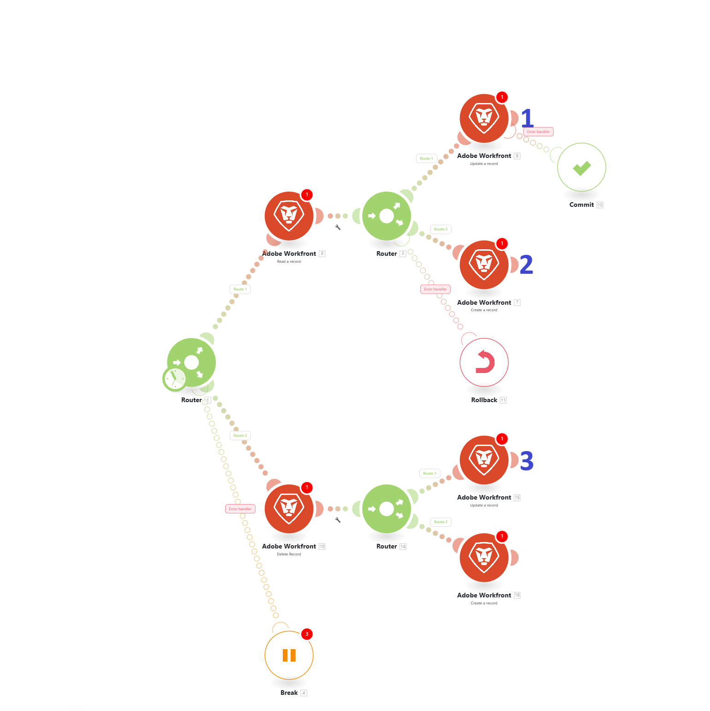

# Adicionar tratamento de erros

Podem ocorrer erros durante a execução de um cenário.

Por exemplo, um erro pode ocorrer porque:

* Um serviço está indisponível devido a uma falha
* Um serviço responde com dados inesperados
* Falha na validação dos dados de entrada
* Outros motivos

Se um módulo encontrar um erro durante a execução do cenário e não houver nenhuma rota de tratamento de erros anexada ao módulo ou sua rota, a lógica de tratamento de erros padrão será executada.

Ao adicionar um manipulador de erros a um módulo ou uma rota, você pode substituir a lógica de manipulação de erros padrão pela sua própria lógica. O Adobe Workfront Fusion oferece cinco diretivas diferentes que podem ser inseridas ao final das rotas do manipulador de erros.

Para obter mais informações sobre tratamento de erros padrão, consulte [Tipos de erros](/help/workfront-fusion/references/errors/error-processing.md).

Para obter mais informações sobre diretivas de tratamento de erros, consulte [Diretivas para tratamento de erros](/help/workfront-fusion/references/errors/directives-for-error-handling.md).

>[!NOTE]
>
>O Workfront Fusion é compatível com o tratamento de erros em nível de rota, permitindo definir a lógica de tratamento de erros uma vez por rota, em vez de anexar manipuladores de erros a cada módulo individual.
>Como o tratamento de erros no nível da rota é uma maneira mais escalável, consistente e arquitetonicamente limpa de gerenciar erros, especialmente em automações avançadas de várias ramificações, recomendamos usar o tratamento de erros no nível da rota como prática recomendada.

## Requisitos de acesso

+++ Expanda para visualizar os requisitos de acesso da funcionalidade neste artigo.

<table style="table-layout:auto">
 <col> 
 <col> 
 <tbody> 
  <tr> 
   <td role="rowheader">Pacote do Adobe Workfront</td> 
   <td> 
Qualquer pacote de fluxo de trabalho do Adobe Workfront e qualquer pacote do Adobe Workfront Automation and Integration

Workfront Ultimate

Os pacotes Workfront Prime e Select, com uma compra adicional do Workfront Fusion.
 </td> 
  </tr> 
  <tr data-mc-conditions=""> 
   <td role="rowheader">Licenças do Adobe Workfront</td> 
   <td> 
Padrão

Trabalho ou maior
 </td> 
  </tr> 
  <tr> 
   <td role="rowheader">Produto</td> 
   <td>
   
Se sua organização tiver um pacote Workfront Select ou Prime, ele não inclui o Workfront Automation and Integration. É necessário comprar o Adobe Workfront Fusion.</li></ul>
   </td> 
  </tr>
 </tbody> 
</table>

Para obter mais detalhes sobre as informações contidas nesta tabela, consulte [Requisitos de acesso na documentação](/help/workfront-fusion/references/licenses-and-roles/access-level-requirements-in-documentation.md).

+++

## Localização e hierarquia do manipulador de erros

Você pode adicionar manipuladores de erro a módulos individuais ou roteadores.

Um manipulador de erros anexado a um módulo do aciona apenas os erros encontrados durante o processamento desse módulo específico.

Um manipulador de erros anexado a um roteador dispara erros encontrados por qualquer módulo na rota desse roteador. Isso inclui erros encontrados em qualquer rota filha que não tenha um manipulador de erros em seu próprio roteador.

Os erros são tratados pela seguinte hierarquia:

1. Módulo
2. Roteador
3. Roteador pai
4. Tratamento de erros padrão

>[!BEGINSHADEBOX]

### Exemplo

Considere o exemplo de cenário a seguir:

1. Este módulo tem um manipulador de erros. Qualquer erro neste módulo é tratado pela diretiva Commit.
1. Este módulo não tem um manipulador de erros. Se este módulo encontrar um erro, o erro será tratado pelo manipulador no roteador que criou a rota do módulo. Qualquer erro nesse módulo é tratado pela diretiva de reversão.
1. Esse módulo não possui um manipulador de erros, nem o roteador que criou a rota do módulo, mas há um manipulador de erros no próximo roteador ativo. Qualquer erro nesse módulo é tratado pela diretiva Break.

>[!NOTE]
>
>* Se um módulo não tiver um manipulador de erros no módulo, no seu roteador ou em qualquer roteador pai, todos os erros nesse módulo serão tratados por tratamento de erros padrão.
>* Para criar um manipulador de erro global, crie um roteador próximo ao início do cenário e anexe o tratamento de erros a esse roteador.

>[!ENDSHADEBOX]

## Adicionar um manipulador de erros

Você pode adicionar um manipulador de erros a um módulo ou roteador.

* [Adicionar um manipulador de erros a um módulo](#add-an-error-handler-to-a-module)
* [Adicionar um manipulador de erros a um roteador](#add-an-error-handler-to-a-router)

### Adicionar um manipulador de erros a um módulo

Para adicionar um manipulador de erros a um módulo:

1. Clique na guia **[!UICONTROL Cenários]** no painel esquerdo.
1. Selecione o cenário em que deseja adicionar uma rota de tratamento de erros.
1. Clique em qualquer lugar no cenário para entrar no editor de cenários.
1. Clique com o botão direito do mouse no módulo após o qual deseja adicionar uma rota de manipulador de erros e selecione **[!UICONTROL Adicionar manipulador de erros]**:

   

   Uma rota de manipulador de erros foi adicionada ao módulo. Se o módulo for o último em uma rota, o manipulador de erros seguirá diretamente o módulo. Se o módulo tiver mais módulos depois dele, uma rota de manipulador de erros separada será adicionada.

   O módulo de manipulação de erros mostra uma lista de Diretivas, bem como os aplicativos que estão sendo usados em seu cenário.

   

1. Selecione uma das diretivas.

   Ou

   Adicione um ou mais módulos à rota do manipulador de erros.

   Se você adicionar mais módulos à rota, a diretiva Ignore será aplicada por padrão. Se houver um erro, os módulos subsequentes nessa rota serão processados.

   Para obter mais informações sobre diretivas, consulte [Diretivas de tratamento de erros](#error-handling-directives) neste artigo.

1. (Opcional) Adicione um filtro à rota de tratamento de erros. Para obter instruções, consulte [Adicionar filtragem e aninhamento a rotas de tratamento de erros](/help/workfront-fusion/create-scenarios/config-error-handling/advanced-error-handling.md).

>[!NOTE]
>
>Observe que uma rota de manipulador de erros é composta de círculos transparentes, enquanto uma rota regular é composta de círculos sólidos.

### Adicionar um manipulador de erros a um roteador

1. Clique na guia **[!UICONTROL Cenários]** no painel esquerdo.
1. Selecione o cenário em que deseja adicionar uma rota de tratamento de erros.
1. Clique em qualquer lugar no cenário para entrar no editor de cenários.
1. Clique com o botão direito do mouse no roteador onde deseja adicionar uma rota de manipulador de erros e selecione **[!UICONTROL Adicionar manipulador de erros]**:

   

   Uma rota de manipulador de erro é adicionada ao roteador.

   O módulo de manipulação de erros mostra uma lista de Diretivas, bem como os aplicativos que estão sendo usados em seu cenário.

   

1. Selecione uma das diretivas.

   Ou

   Adicione um ou mais módulos à rota do manipulador de erros.

   Se você adicionar mais módulos à rota, a diretiva Ignore será aplicada por padrão. Se houver um erro, os módulos subsequentes nessa rota serão processados.

   Para obter mais informações sobre diretivas, consulte [Diretivas de tratamento de erros](#error-handling-directives) neste artigo.

1. (Opcional) Adicione um filtro à rota de tratamento de erros. Para obter instruções, consulte [Adicionar filtragem e aninhamento a rotas de tratamento de erros](/help/workfront-fusion/create-scenarios/config-error-handling/advanced-error-handling.md).

## Erro ao manipular diretivas

As diretivas são resumidamente explicadas a seguir. Para obter mais informações, consulte [Diretivas para tratamento de erros](/help/workfront-fusion/references/errors/directives-for-error-handling.md).

Há cinco diretivas, que podem ser agrupadas nas seguintes categorias com base no fato de uma execução de cenário continuar após o erro.

As diretivas a seguir garantem que uma execução de cenário continue:

* **[!UICONTROL Retomar]**: permite especificar uma saída substituta para o módulo com o erro. O status de execução do cenário é marcado como sucesso.
* **[!UICONTROL Ignorar]**: ignora o erro. O status de execução do cenário é marcado como sucesso.
* **[!UICONTROL Intervalo]**: armazena a entrada na fila de execuções incompletas. O status de execução do cenário está marcado como aviso.

  Para obter mais informações, consulte [Exibir e resolver execuções incompletas](/help/workfront-fusion/manage-scenarios/view-and-resolve-incomplete-executions.md).

Se uma execução de cenário precisar parar quando ocorrer um erro, use uma das seguintes diretivas:

* **[!UICONTROL Reversão]**: interrompe a execução do cenário imediatamente e marca seu status como erro.
* **[!UICONTROL Confirmar]**: interrompe a execução do cenário imediatamente e marca seu status como êxito.

## Recursos

Para obter mais informações sobre o tratamento de erros, consulte:

* [Diretivas para tratamento de erros no Adobe Workfront Fusion](/help/workfront-fusion/references/errors/directives-for-error-handling.md)
* [Adicionar filtragem e aninhamento a rotas de tratamento de erros](/help/workfront-fusion/create-scenarios/config-error-handling/advanced-error-handling.md)
