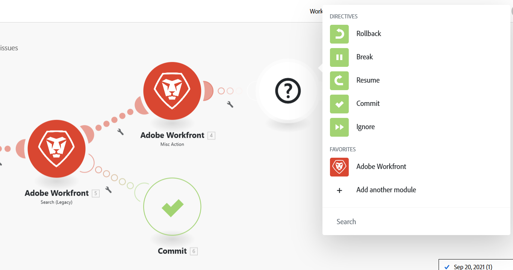

# Adicionar manipulação de erros

Podem ocorrer erros durante a execução de um cenário.

Por exemplo, um erro pode ocorrer porque:

* Um serviço está indisponível devido a uma falha
* Um serviço responde com dados inesperados
* Falha na validação dos dados de entrada
* Outros motivos

Se um módulo encontrar um erro durante a execução do cenário e não houver nenhuma rota de tratamento de erros anexada ao módulo, a lógica de tratamento de erros padrão será executada.

Ao adicionar uma rota de manipulador de erros a um módulo, você pode substituir a lógica de manipulação de erros padrão pela sua própria. O Adobe Workfront Fusion oferece cinco diretivas diferentes que podem ser inseridas ao final das rotas do manipulador de erros.

Para obter mais informações sobre tratamento de erros padrão, consulte [Tipos de erros](/help/workfront-fusion/references/errors/error-processing.md).

Para obter mais informações sobre diretivas de tratamento de erros, consulte [Diretivas para tratamento de erros](/help/workfront-fusion/references/errors/directives-for-error-handling.md).

## Requisitos de acesso

+++ Expanda para visualizar os requisitos de acesso para a funcionalidade neste artigo.

Você deve ter o seguinte acesso para usar a funcionalidade neste artigo:

<table style="table-layout:auto">
 <col> 
 <col> 
 <tbody> 
  <tr> 
   <td role="rowheader">Pacote do Adobe Workfront 
   <td> 
Qualquer
 </td> 
  </tr> 
  <tr data-mc-conditions=""> 
   <td role="rowheader">Licença do Adobe Workfront</td> 
   <td> 
Novo: Padrão

Ou

Atual: trabalho ou superior
 </td> 
  </tr> 
  <tr> 
   <td role="rowheader">Licença do Adobe Workfront Fusion**</td> 
   <td>
   
Atual: nenhum requisito de licença do Workfront Fusion

   
Ou

   
Herdados: Qualquer um 

   </td> 
  </tr> 
  <tr> 
   <td role="rowheader">Produto</td> 
   <td>
   
Novo:
 <ul><li>Selecione ou Prime Workfront Plan: sua organização deve comprar o Adobe Workfront Fusion.</li><li>Plano do Ultimate Workfront: o Workfront Fusion está incluído.</li></ul>
   
Ou

   
Atual: sua organização deve comprar o Adobe Workfront Fusion.

   </td> 
  </tr>
 </tbody> 
</table>

Para obter mais detalhes sobre as informações nesta tabela, consulte [Requisitos de acesso na documentação](/help/workfront-fusion/references/licenses-and-roles/access-level-requirements-in-documentation.md).

Para obter informações sobre licenças do Adobe Workfront Fusion, consulte [licenças do Adobe Workfront Fusion](/help/workfront-fusion/set-up-and-manage-workfront-fusion/licensing-operations-overview/license-automation-vs-integration.md).

+++

## Adicionar um manipulador de erros

Para adicionar um manipulador de erros a um módulo:

1. Clique na guia **[!UICONTROL Cenários]** no painel esquerdo.
1. Selecione o cenário em que deseja adicionar uma rota de tratamento de erros.
1. Clique em qualquer lugar no cenário para entrar no editor de cenários.
1. Clique com o botão direito do mouse no módulo após o qual deseja adicionar uma rota de manipulador de erros e selecione **[!UICONTROL Adicionar manipulador de erros]**:

   

   Uma rota de manipulador de erros foi adicionada ao módulo. Se o módulo for o último em uma rota, o manipulador de erros seguirá diretamente o módulo. Se o módulo tiver mais módulos depois dele, uma rota de manipulador de erros separada será adicionada.

   O módulo de manipulação de erros mostra uma lista de Diretivas, bem como os aplicativos que estão sendo usados em seu cenário.

   

1. Selecione uma das diretivas.

   Ou

   Adicione um ou mais módulos à rota do manipulador de erros.

   Se você adicionar mais módulos à rota, a diretiva Ignore será aplicada por padrão. Se houver um erro, os módulos subsequentes nessa rota serão processados.

   Para obter mais informações sobre diretivas, consulte [Diretivas de tratamento de erros](#error-handling-directives) neste artigo.

1. (Opcional) Adicione um filtro à rota de tratamento de erros. Para obter instruções, consulte [Adicionar filtragem e aninhamento a rotas de tratamento de erros](/help/workfront-fusion/create-scenarios/config-error-handling/advanced-error-handling.md).

>[!NOTE]
>
>Observe que uma rota de manipulador de erros é composta de círculos transparentes, enquanto uma rota regular é composta de círculos sólidos.

## Erro ao manipular diretivas

As diretivas são resumidamente explicadas a seguir. Para obter mais informações, consulte [Diretivas para tratamento de erros](/help/workfront-fusion/references/errors/directives-for-error-handling.md).

Há cinco diretivas, que podem ser agrupadas nas seguintes categorias com base no fato de uma execução de cenário continuar após o erro.

As diretivas a seguir garantem que uma execução de cenário continue:

* **[!UICONTROL Retomar]**: permite especificar uma saída substituta para o módulo com o erro. O status de execução do cenário é marcado como sucesso.
* **[!UICONTROL Ignorar]**: ignora o erro. O status de execução do cenário é marcado como sucesso.
* **[!UICONTROL Intervalo]**: armazena a entrada na fila de execuções incompletas. O status de execução do cenário está marcado como aviso.

  Para obter mais informações, consulte [Exibir e resolver execuções incompletas](/help/workfront-fusion/manage-scenarios/view-and-resolve-incomplete-executions.md).

Se uma execução de cenário precisar parar quando ocorrer um erro, use uma das seguintes diretivas:

* **[!UICONTROL Reversão]**: interrompe a execução do cenário imediatamente e marca seu status como erro.
* **[!UICONTROL Confirmar]**: interrompe a execução do cenário imediatamente e marca seu status como êxito.

## Recursos

Para obter mais informações sobre o tratamento de erros, consulte:

* [Diretivas para tratamento de erros no Adobe Workfront Fusion](/help/workfront-fusion/references/errors/directives-for-error-handling.md)
* [Adicionar filtragem e aninhamento a rotas de tratamento de erros](/help/workfront-fusion/create-scenarios/config-error-handling/advanced-error-handling.md)
