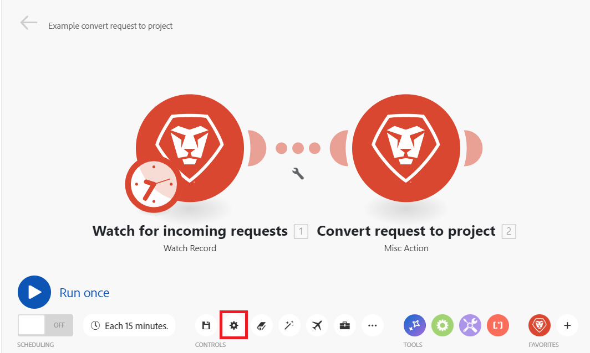
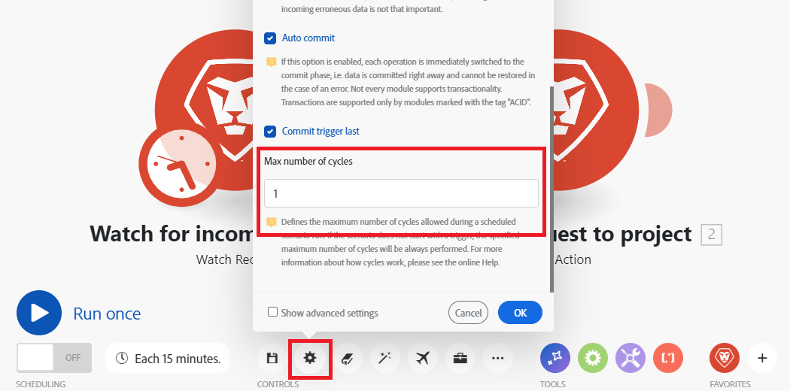

# Definir configurações de cenário

Você pode definir configurações específicas para cenários no painel configurações de cenário.

## Requisitos de acesso

+++ Expanda para visualizar os requisitos de acesso para a funcionalidade neste artigo.

Você deve ter o seguinte acesso para usar a funcionalidade neste artigo:

<table style="table-layout:auto">
 <col> 
 <col> 
 <tbody> 
  <tr> 
   <td role="rowheader">plano do Adobe Workfront</td> 
   <td> 
Qualquer
 </td> 
  </tr> 
  <tr data-mc-conditions=""> 
   <td role="rowheader">Licença do Adobe Workfront</td> 
   <td> 
Novo: Padrão

Ou

Atual: [!UICONTROL Trabalho] ou superior
 </td> 
  </tr> 
  <tr> 
   <td role="rowheader">Licença do Adobe Workfront Fusion**</td> 
   <td>
   
Atual: nenhum requisito de licença do Workfront Fusion.

   
Ou

   
Herdados: Qualquer um 

   </td> 
  </tr> 
  <tr> 
   <td role="rowheader">Produto</td> 
   <td>
   
Novo menu:
 <ul><li>Plano do Workfront para [!UICONTROL Select] ou [!UICONTROL Prime]: sua organização deve comprar o Adobe Workfront Fusion.</li><li>Plano do Workfront do [!UICONTROL Ultimate]: o Workfront Fusion está incluído.</li></ul>
   
Ou

   
Atual: sua organização deve comprar o Adobe Workfront Fusion.

   </td> 
  </tr>
  <tr data-mc-conditions=""> 
   <td role="rowheader">Configurações de nível de acesso*</td> 
   <td> 
     
Você deve ser um administrador do Workfront Fusion para sua organização.

     
Você deve ser um administrador do Workfront Fusion para sua equipe.

   </td> 
  </tr> 
   </td> 
  </tr> 
 </tbody> 
</table>

Para obter mais detalhes sobre as informações nesta tabela, consulte [Requisitos de acesso na documentação do Workfront](/help/workfront-fusion/references/licenses-and-roles/access-level-requirements-in-documentation.md).

Para obter informações sobre licenças do Adobe Workfront Fusion, consulte [licenças do Adobe Workfront Fusion](/help/workfront-fusion/set-up-and-manage-workfront-fusion/licensing-operations-overview/license-automation-vs-integration.md).

+++

## Abrir as configurações do cenário

1. Clique em **Cenários** no painel esquerdo.
1. Localize o cenário desejado e clique no nome.
1. Clique em qualquer lugar no cenário para entrar no editor de cenários.
1. Clique no ícone de engrenagem próximo ao canto inferior esquerdo da página.

   

   No painel [!UICONTROL Configurações de cenário] que é exibido, você pode definir várias configurações avançadas para o cenário.
1. Ative ou desative as configurações de Cenário conforme necessário. Consulte [Opções de configurações do cenário](#scenario-settings-options) abaixo.

## Opções de configurações de cenário

### [!UICONTROL Processamento sequencial]

Essa opção força todas as execuções a ocorrerem em ordem e é relevante principalmente para Webhooks e Execuções incompletas.

Quando o processamento sequencial está ativado, as execuções paralelas do cenário são desativadas.

**Webhooks instantâneos**: se um gatilho de webhook estiver configurado como `instant` e o &quot;Processamento sequencial&quot; estiver habilitado, todas as cargas de webhook instantâneas serão enfileiradas e processadas na ordem em que chegarem. Isso pode ser útil ao processar eventos de sistemas externos em uma ordem exata.

>[!NOTE]
>
>Haverá atrasos de processamento automático, pois cada carga será processada antes que a próxima seja iniciada.

**Execuções Incompletas**: se a opção &quot;Execuções Incompletas&quot; também estiver habilitada, caso ocorra um erro durante a execução de um cenário, ele será pausado. Uma das situações a seguir ocorre:

* Se a opção de processamento Sequencial estiver **habilitada**, o Workfront Fusion interromperá o processamento da sequência pré-existente até que todas as execuções incompletas sejam resolvidas.
* Se a opção de processamento Sequencial estiver **desabilitada**, o cenário continuará a ser executado de acordo com seu cronograma, acompanhado por tentativas repetidas de executar novamente as execuções incompletas.

  Para obter mais informações sobre execuções incompletas, consulte [Exibir e resolver execuções incompletas](/help/workfront-fusion/manage-scenarios/view-and-resolve-incomplete-executions.md).

  >[!NOTE]
  >
  >O processamento sequencial pode causar um atraso na execução de um cenário. Se ainda houver execuções incompletas na fila quando um cenário instantâneo for acionado ou um cenário programado for definido para execução, esse cenário será executado após a conclusão de todas as execuções antes de ser concluído na fila.
  >
  >Se o caso de uso para seus cenários não exigir processamento sequencial, recomendamos desativar a opção de processamento sequencial.

  Para obter mais informações sobre agendamento, consulte [Agendar um cenário](/help/workfront-fusion/create-scenarios/config-scenarios-settings/schedule-a-scenario.md).

### Os dados são confidenciais

Depois que um cenário é executado, você pode exibir informações padrão sobre quais dados foram processados pelos módulos no cenário. Se você não quiser que essas informações sejam armazenadas, habilite a opção [!UICONTROL Os dados são confidenciais].

>[!IMPORTANT]
>
>Se você habilitar essa opção, poderá ser difícil resolver erros que possam ocorrer durante a execução de um cenário.

### [!UICONTROL Permitir o armazenamento de execuções incompletas]

Essa opção determina como o Adobe Workfront Fusion procede se ocorrer um erro durante a execução de um cenário. Com essa opção ativada, o cenário é pausado e movido para a pasta de execução incompleta. Isso oferece a possibilidade de corrigir o problema e continuar a execução de onde o cenário foi interrompido. Se essa opção estiver desativada, a execução do cenário será interrompida e uma fase de reversão será iniciada.

Para obter mais informações sobre execuções incompletas, consulte [Exibir e resolver execuções incompletas](/help/workfront-fusion/manage-scenarios/view-and-resolve-incomplete-executions.md).

### Ativar perda de dados

Essa opção tem a ver com ativar a perda de dados se o Workfront Fusion falhar ao salvar um pacote na fila de execuções incompletas (por exemplo, devido à falta de espaço livre). Com essa opção ativada, os dados são perdidos para evitar interrupções na execução geral do cenário. Isso é útil para cenários em que a prioridade mais alta é a execução contínua e os dados incorretos recebidos não são tão importantes.

Além disso, ao executar um cenário, um módulo pode às vezes encontrar um arquivo maior do que o tamanho máximo permitido. Nesse caso, o Workfront Fusion continua de acordo com a configuração da opção [!UICONTROL Habilitar perda de dados], e uma mensagem de aviso é exibida.

Para obter mais informações sobre execuções incompletas, consulte [Exibir e resolver execuções incompletas](/help/workfront-fusion/manage-scenarios/view-and-resolve-incomplete-executions.md).

Para obter mais informações sobre o tamanho máximo do arquivo, consulte [Medidas de proteção de desempenho do Fusion](/help/workfront-fusion/references/scenarios/fusion-performance-guardrails.md#files).

Para obter mais informações sobre avisos, consulte [Tipos de erro](/help/workfront-fusion/references/errors/error-processing.md).

### [!UICONTROL Confirmação automática]

As configurações de [!UICONTROL Confirmação automática] se aplicam a transações e definem a maneira de processar um cenário. Se a opção Confirmar automaticamente estiver ativada, a fase de confirmação em cada módulo será iniciada imediatamente após a conclusão da fase de operação. Com a opção Confirmar automaticamente desativada, nenhuma confirmação ocorre até que as operações sejam executadas para todos os módulos (esse é o modo padrão).

### Número máximo de ciclos

>[!NOTE]
>
>Você deve habilitar a caixa de seleção **Mostrar configurações avançadas** para ver esta opção.

Definir mais ciclos pode ser útil quando você deseja impedir a interrupção da conexão com um serviço de terceiros e garantir que todos os registros sejam processados dentro de uma execução de cenário.

* Se o cenário começar com um acionador de sondagem, a configuração definirá o número máximo de ciclos permitidos durante a execução do cenário.

  Para obter mais informações sobre acionadores de sondagem, consulte [Acionadores de sondagem](/help/workfront-fusion/get-started-with-fusion/understand-fusion/module-overview.md#polling-triggers) no artigo Visão geral do módulo.

* Se o cenário começar com um acionador instantâneo, a configuração será ignorada e todos os eventos pendentes serão processados durante uma única execução de cenário, um evento por ciclo.

  Para obter mais informações sobre acionadores instantâneos, consulte [Acionadores instantâneos](/help/workfront-fusion/get-started-with-fusion/understand-fusion/module-overview.md#instant-triggers) no artigo Visão geral do módulo.

* Se o cenário não iniciar com um acionador (instantâneo/polling), o número máximo de ciclos especificado será sempre executado.

>[!BEGINSHADEBOX]

**Exemplos:** Workfront > [!UICONTROL Observar registro] verifica novos problemas que entram, e Workfront >[!UICONTROL Converter objeto] converte a nova solicitação em um projeto e atribui a ela o modelo apropriado.

Uma configuração de [!UICONTROL mais ciclos] é aplicada somente quando você agenda a execução do cenário. Ao usar o botão [!UICONTROL Executar uma vez], as configurações de ciclo são consideradas.

#### O número máximo de ciclos é definido como 1 (padrão)

O número máximo de ciclos no módulo Workfront > Registros de observação está definido como `10`.
Se 100 solicitações forem enviadas ao Workfront e o campo Número máximo de ciclos for definido como 10, 90 arquivos serão deixados sem processamento após a execução de um cenário. Os próximos 10 arquivos são processados na próxima execução de cenário agendada.

#### O número máximo de ciclos é definido como 10

O número máximo de ciclos no módulo Workfront > Registros de observação está definido como `10`.

Se 100 arquivos forem adicionados à pasta do Dropbox e a opção Número máximo de ciclos for definida como 10, 10 arquivos serão processados durante o primeiro ciclo, os próximos 10 arquivos no segundo ciclo, os próximos 10 arquivos no terceiro ciclo e assim por diante, até que todos os arquivos sejam processados.

Todos os arquivos são processados em 1 execução de cenário.

Você pode ver os ciclos já executados nos detalhes do Cenário:

Para obter mais informações sobre esta página, consulte [Detalhes do cenário](/help/workfront-fusion/get-started-with-fusion/navigate-fusion/scenario-details.md).

>[!ENDSHADEBOX]

### Número de erros consecutivos

Define o número máximo de tentativas consecutivas de execução antes da desativação da execução de um cenário (excluindo `DataError`, `DuplicateDataError`, `ModuleTimeoutError` e `ConnectionError`).

Para obter mais informações sobre erros, consulte [Tipos de erro](/help/workfront-fusion/references/errors/error-processing.md).

>[!NOTE]
>
>Se um cenário inicia com um acionador instantâneo, a configuração é ignorada e o cenário é desativado imediatamente após a ocorrência do primeiro erro.

### Pool de trabalhadores

>[!NOTE]
>
>Essa configuração será visível somente se as duas condições a seguir forem atendidas:
>
>* Você é um administrador ou proprietário de organização
>* Mais de um pool de trabalhadores está associado à sua organização.

Essa configuração atribui o cenário a um pool de trabalhadores específico associado à sua organização, permitindo que você dedique recursos a cenários de alta prioridade.
