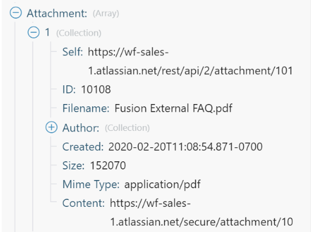

# Mapear uma matriz ou elemento de matriz

Uma matriz é um item do pacote que pode conter o seguinte:

* Um ou mais valores do mesmo tipo (matriz simples)
* Uma ou mais coleções do mesmo tipo (matriz complexa)

>[!BEGINSHADEBOX]

**Exemplo:**

* **Matriz complexa**: o módulo [!UICONTROL Assistir emails] retorna uma matriz de anexos para cada email. Cada anexo representa uma coleção que pode conter um nome, conteúdo, tamanho e assim por diante.

>[!ENDSHADEBOX]

## Requisitos de acesso

+++ Expanda para visualizar os requisitos de acesso para a funcionalidade neste artigo.

Você deve ter o seguinte acesso para usar a funcionalidade neste artigo:

<table style="table-layout:auto">
 <col> 
 <col> 
 <tbody> 
  <tr> 
   <td role="rowheader">Pacote do Adobe Workfront</td> 
   <td> 
Qualquer
 </td> 
  </tr> 
  <tr data-mc-conditions=""> 
   <td role="rowheader">Licença do Adobe Workfront</td> 
   <td> 
Novo: Padrão

Ou

Atual: [!UICONTROL Trabalho] ou superior
 </td> 
  </tr> 
  <tr> 
   <td role="rowheader">Licença do Adobe Workfront Fusion**</td> 
   <td>
   
Atual: nenhum requisito de licença do Workfront Fusion.

   
Ou

   
Herdados: Qualquer um 

   </td> 
  </tr> 
  <tr> 
   <td role="rowheader">Produto</td> 
   <td>
   
Novo menu:
 <ul><li>Plano do Workfront para [!UICONTROL Select] ou [!UICONTROL Prime]: sua organização deve comprar o Adobe Workfront Fusion.</li><li>Plano do Workfront do [!UICONTROL Ultimate]: o Workfront Fusion está incluído.</li></ul>
   
Ou

   
Atual: sua organização deve comprar o Adobe Workfront Fusion.

   </td> 
  </tr>
 </tbody> 
</table>

Para obter mais detalhes sobre as informações nesta tabela, consulte [Requisitos de acesso na documentação](/help/workfront-fusion/references/licenses-and-roles/access-level-requirements-in-documentation.md).

Para obter informações sobre licenças do Adobe Workfront Fusion, consulte [licenças do Adobe Workfront Fusion](/help/workfront-fusion/set-up-and-manage-workfront-fusion/licensing-operations-overview/license-automation-vs-integration.md).

+++

## Mapear uma matriz inteira

1. Clique na guia **[!UICONTROL Cenários]** no painel esquerdo.
1. Selecione o cenário no qual deseja mapear uma matriz.
1. Clique em qualquer lugar no cenário para entrar no editor de cenários.
1. No módulo para o qual deseja mapear a matriz, clique no campo onde deseja mapear a matriz. Este é o campo para o qual a matriz está mapeada.

1. Na caixa exibida, mapeie o item.

   O painel permite mapear campos da mesma forma que com qualquer outro tipo de item. Se você não quiser preencher cada item separadamente, mas quiser mapear outra matriz no campo de destino, use o botão [!UICONTROL Mapear]. Nesse caso, verifique se ambos os storages (o storage de origem e o storage de destino) têm a mesma estrutura.

   Você pode adicionar qualquer número de itens a uma matriz.

É possível dividir uma matriz em pacotes individuais usando um iterador. Para obter mais informações, consulte o módulo [[!UICONTROL Iterador] no Adobe Workfront Fusion](/help/workfront-fusion/references/modules/iterator-module.md).

## Mapear itens em uma nova matriz

Alguns campos no Workfront Fusion permitem mapear elementos em uma matriz. Por exemplo, você pode criar uma matriz de itens de lista de verificação no módulo Workfront Boards > Adicionar item de lista de verificação. Quando o módulo é executado, todos os itens da lista de verificação são adicionados ao cartão.

Qualquer campo do módulo que exibe &quot;Adicionar item&quot; cria uma matriz.

Para adicionar elementos à matriz:

1. Clique em **Adicionar item**
1. No painel aberto, insira detalhes sobre o item.
1. Clique em **Adicionar**.
1. (Opcional) Repita as etapas 1 a 3 para cada elemento que você deseja adicionar à matriz .

## Mapear elementos de matriz

### Mapear elementos de matriz por número

Os elementos da matriz são exibidos como um número entre colchetes após o nome da matriz. Você pode mapear um elemento individual de uma matriz em um campo usando esse número de índice.

>[!NOTE]
>
>A indexação de arrays no Workfront Fusion começa em 1.

Para mapear um elemento de matriz:

1. Clique no campo onde deseja mapear o elemento.

   O painel de mapeamento é aberto.

1. Localize a matriz que contém o elemento que você deseja mapear.
1. Clique na seta suspensa ao lado da matriz.
1. Clique no elemento que deseja mapear.

   O elemento é mapeado, com o índice de 1. Isso mapeia o primeiro elemento na matriz.

1. Para mapear um elemento diferente da matriz, clique em [1] e insira o número de índice do elemento de matriz que você deseja mapear.

   

### Mapear um elemento de matriz com uma determinada chave

Algumas matrizes contêm coleções com itens de valores-chave, como metadados, atributos e assim por diante. Para usar um desses valores, você pode pesquisar um elemento por seu valor de chave fornecido e obter o valor correspondente do item de valor. Recomendamos usar uma fórmula que empregue uma combinação das funções `map()` e `get()`.

>[!BEGINSHADEBOX]

O exemplo a seguir mostra a saída do aplicativo [!DNL Jira].

Este exemplo obtém um nome de arquivo de uma matriz de anexos, para o anexo específico com uma ID 10108.

Esse exemplo gera a seguinte saída:

A fórmula pode ser explicada da seguinte maneira:

* `map`

   1. O primeiro parâmetro da função `map()` é o item de matriz inteiro.
   1. O segundo parâmetro é o nome bruto do item de valor. Para obter o nome bruto, passe o mouse sobre o item no painel [!UICONTROL mapeamento]:

      

      >[!NOTE]
      >
      >Todos os parâmetros diferenciam maiúsculas de minúsculas. Mesmo que neste exemplo em particular o rótulo do item difira de seu nome bruto apenas em maiúsculas, é necessário usar o nome bruto.

   1. O terceiro parâmetro é o nome bruto do item-chave:

      

   1. O quarto parâmetro é o valor de chave fornecido.

  Como a função `map()` retorna uma matriz (já que poderia haver mais elementos com o valor de chave fornecido), é necessário aplicar a função `get()` para obter seu primeiro elemento:

* `get`

   1. O primeiro parâmetro da função `get()` é o resultado da função `map()`.

   1. O segundo parâmetro é o índice do elemento. Neste exemplo, o índice é `1`.

Esse exemplo gera a seguinte saída:

>[!ENDSHADEBOX]

Para obter mais informações sobre a função `map()`, consulte [Funções de matriz](/help/workfront-fusion/references/mapping-panel/functions/array-functions.md).

Para obter mais informações sobre a função `get()`, consulte [Funções gerais](/help/workfront-fusion/references/mapping-panel/functions/general-functions.md).

## Converter elementos de matriz em uma série de pacotes

Matrizes podem ser convertidas em uma série de conjuntos usando o módulo [!UICONTROL Iterador]. Para obter mais informações, consulte [[!UICONTROL Iterador] módulo](/help/workfront-fusion/references/modules/iterator-module.md).

