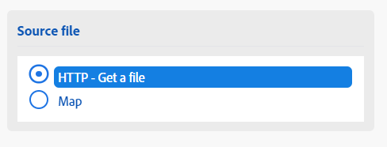

# Mapear um arquivo entre módulos

Alguns módulos podem processar arquivos. Esses módulos podem retornar um arquivo de saída para ser enviado para processamento adicional ou exigir que um arquivo seja passado a eles para processamento. Os arquivos podem ser mapeados, de modo que uma saída de arquivo por um módulo possa ser processada por outro.

## Requisitos de acesso

+++ Expanda para visualizar os requisitos de acesso para a funcionalidade neste artigo.

Você deve ter o seguinte acesso para usar a funcionalidade neste artigo:

<table style="table-layout:auto">
 <col> 
 <col> 
 <tbody> 
  <tr> 
   <td role="rowheader">Pacote do Adobe Workfront</td> 
   <td> 
Qualquer
 </td> 
  </tr> 
  <tr data-mc-conditions=""> 
   <td role="rowheader">Licença do Adobe Workfront</td> 
   <td> 
Novo: Padrão

Ou

Atual: [!UICONTROL Trabalho] ou superior
 </td> 
  </tr> 
  <tr> 
   <td role="rowheader">Licença do Adobe Workfront Fusion**</td> 
   <td>
   
Atual: nenhum requisito de licença do Workfront Fusion.

   
Ou

   
Herdados: Qualquer um 

   </td> 
  </tr> 
  <tr> 
   <td role="rowheader">Produto</td> 
   <td>
   
Novo menu:
 <ul><li>Plano do Workfront para [!UICONTROL Select] ou [!UICONTROL Prime]: sua organização deve comprar o Adobe Workfront Fusion.</li><li>Plano do Workfront do [!UICONTROL Ultimate]: o Workfront Fusion está incluído.</li></ul>
   
Ou

   
Atual: sua organização deve comprar o Adobe Workfront Fusion.

   </td> 
  </tr>
  <tr data-mc-conditions=""> 
   <td role="rowheader">Configurações de nível de acesso*</td> 
   <td> 
     
Você deve ser um administrador do Workfront Fusion para sua organização.

     
Você deve ser um administrador do Workfront Fusion para sua equipe.

   </td> 
  </tr> 
   </td> 
  </tr> 
 </tbody> 
</table>

Para obter mais detalhes sobre as informações nesta tabela, consulte [Requisitos de acesso na documentação](/help/workfront-fusion/references/licenses-and-roles/access-level-requirements-in-documentation.md).

Para obter informações sobre licenças do Adobe Workfront Fusion, consulte [licenças do Adobe Workfront Fusion](/help/workfront-fusion/set-up-and-manage-workfront-fusion/licensing-operations-overview/license-automation-vs-integration.md).

+++

## Mapear arquivos dos módulos de origem para os módulos de destino

Os módulos podem processar arquivos que exigem duas informações:

* Nome do arquivo
* Conteúdo do arquivo (dados)

Se qualquer módulo anterior produzir um arquivo, você poderá selecionar o módulo de origem, e o nome e os dados do arquivo emitido por esse módulo serão mapeados para o módulo de destino.

Você também pode inserir esse nome e dados manualmente ou mapeá-los de módulos anteriores. Isso pode ser conveniente quando, por exemplo, renomear um arquivo.

>[!NOTE]
>
>Se você precisar processar um arquivo de uma URL, recomendamos usar o módulo `HTTP > Get a File` para baixar o arquivo da URL e, em seguida, mapear o arquivo do módulo `HTTP > Get a File` para o campo do módulo desejado em seu cenário.
>
>

Para mapear um arquivo:

1. Clique na guia **[!UICONTROL Cenários]** no painel esquerdo.
1. Selecione o cenário no qual deseja mapear um arquivo.
1. Clique em qualquer lugar no cenário para entrar no editor de cenários.
1. No módulo de destino, que é o destino para o qual você está mapeando, localize a área **arquivo do Source**.
1. Para mapear uma saída de arquivo por um módulo anterior, selecione o módulo que produz o arquivo.

   

1. Para mapear o nome e os dados manualmente, selecione Mapear e, em seguida, insira ou mapeie o nome e os dados do arquivo.

   

1. Continue a configurar o módulo ou clique em **OK**.
