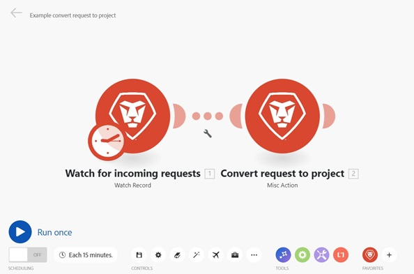

# O editor de cenários

O editor de cenários permite criar e editar cenários em uma interface visual.

## Requisitos de acesso

+++ Expanda para visualizar os requisitos de acesso para a funcionalidade neste artigo.

<table style="table-layout:auto">
 <col> 
 <col> 
 <tbody> 
  <tr> 
   <td role="rowheader">Pacote do Adobe Workfront</td> 
   <td> 
Qualquer pacote de fluxo de trabalho do Adobe Workfront e qualquer pacote de Automação e Integração do Adobe Workfront

Workfront Ultimate

Workfront Prime e pacotes Select, com uma compra adicional do Workfront Fusion.
 </td> 
  </tr> 
  <tr data-mc-conditions=""> 
   <td role="rowheader">Licenças do Adobe Workfront</td> 
   <td> 
Standard

Trabalhar ou superior
 </td> 
  </tr> 
  <tr> 
   <td role="rowheader">Produto</td> 
   <td>
   
Se sua organização tiver um pacote Select ou Prime Workfront que não inclua a Automação e Integração do Workfront, ela deverá comprar o Adobe Workfront Fusion.</li></ul>
   </td> 
  </tr>
 </tbody> 
</table>

Para obter mais detalhes sobre as informações nesta tabela, consulte [Requisitos de acesso na documentação](/help/workfront-fusion/references/licenses-and-roles/access-level-requirements-in-documentation.md).

+++

## Abra o editor de cenários e adicione um módulo:

1. Clique em **[!UICONTROL Cenários]**  no painel esquerdo.
1. Clique no ícone de ponto de interrogação , localize e clique no aplicativo ou serviço com o qual deseja começar. Para obter informações detalhadas sobre como configurar um módulo, consulte [Configurar um módulo](/help/workfront-fusion/create-scenarios/add-modules/configure-a-modules-settings.md).

## Ações disponíveis do editor de cenário

### Executar seu cenário

| Ação | Detalhes |
|----------|----------|
| Testar o cenário | Verifique se o cenário é executado como esperado antes de ativá-lo. Uma vez ativado, o cenário será executado de acordo com seu cronograma. Se tudo não funcionar conforme o esperado, consulte [Adicionar tratamento de erros](/help/workfront-fusion/create-scenarios/config-error-handling/error-handling.md) para saber como lidar com erros. |

### Agendamento

| Ação | Detalhes |
|----------|----------|
| Agendar o cenário | Por padrão, um cenário é executado a cada 15 minutos. Você pode alterar isso definindo quando e com que frequência um cenário ativado é executado. Os cenários de fusão podem ser agendados para execução com uma frequência de até 5 minutos. Para obter mais informações, consulte [Agendar um cenário](/help/workfront-fusion/create-scenarios/config-scenarios-settings/schedule-a-scenario.md). |

### Controles

Talvez seja necessário clicar no ícone de três pontos na área Controles para exibir alguns desses controles.

| Ação | Detalhes |
|----------|----------|
| Salvar 

 | Depois de salvar o cenário, uma nova versão estará disponível no menu de três pontos, caso você precise acessá-lo no futuro. As versões de cenários salvas anteriormente só estão disponíveis por 60 dias. |
| Configurações de cenário 

 | O painel Configurações de cenário contém configurações avançadas para o cenário. Para obter mais informações sobre as configurações disponíveis, consulte [Definir configurações de cenário](/help/workfront-fusion/create-scenarios/config-scenarios-settings/configure-scenario-settings.md). |
| Notas  

 | Faça observações sobre o cenário. Outros usuários podem exibir essas notas quando estão no cenário. |
| Alinhamento automático 

 | Alinhe automaticamente os módulos no seu cenário. |
| Pesquisar módulos   
 | Insira um termo de pesquisa para localizar um módulo e, em seguida, clique nos resultados da pesquisa a serem levados para esse módulo. Você pode pesquisar por nome do módulo, ID, tipo ou aplicativo. |
| Explicar fluxo  
 
 | Exibir uma animação em que os pontos móveis mostram como os dados fluem pelo cenário. |
| DevTool 

 | Usando a DevTool, você pode verificar todas as execuções manuais do seu cenário, revisar todas as operações realizadas e ver os detalhes de cada chamada de API realizada. Você pode ver qual módulo, operação ou única resposta causou o erro e usar esse conhecimento para refinar seu cenário. Para obter mais informações, consulte [Depurar um cenário](/help/workfront-fusion/manage-scenarios/debug-a-scenario.md). |
| Exportar blueprint  
 
 | Exportar um blueprint do cenário atual. |
| Importar blueprint  
 
 | Importe um blueprint de cenário exportado anteriormente. |
| Versão anterior  
 
 | Exibir versões anteriores deste cenário. |

### Ferramentas

| Ação | Detalhes |
|----------|----------|
| Controle de fluxo | Defina as configurações para controlar como os dados fluem através dele. Para obter mais informações, [consulte o link necessário]. |
| Ferramentas | A seção de ferramentas contém vários módulos úteis que podem aprimorar seus cenários. Para obter mais informações, [consulte o link necessário]. |
| Analisador de texto | Use a ferramenta Analisador de texto para analisar o texto para uso em outros módulos de cenário. O analisador de Texto não requer uma conexão. Para obter mais informações, [consulte o link necessário]. |

### Favoritos

Você pode usar o ícone Favoritos para adicionar módulos usados com frequência.

