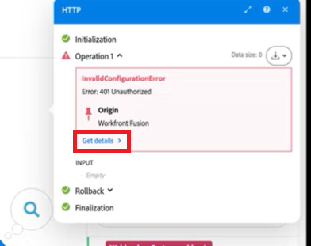

# Depurar um cenário

O Adobe Workfront Fusion Devtool ajuda você a entender e solucionar problemas de cenários. Usando o Devtool, você pode verificar todas as execuções manuais do cenário, revisar todas as operações executadas e ver os detalhes de cada chamada de API executada. Você pode ver qual módulo, operação ou única resposta causou o erro e usar esse conhecimento para refinar seu cenário.

>[!NOTE]
>
>Fazer logon no painel do depurador será limitado ou não estará disponível para cenários confidenciais, execuções automáticas e operações bem-sucedidas.

Para obter uma introdução em vídeo e uma apresentação do Fusion Devtool, consulte

* [Ferramenta de Desenvolvimento Fusion](https://video.tv.adobe.com/v/3427031/){target=_blank}
* [Apresentação de Devtool](https://experienceleague.adobe.com/docs/workfront-learn/tutorials-workfront/fusion/troubleshooting-and-error-handling/dev-tool-walkthrough.html?lang=pt-BR)

## Requisitos de acesso

+++ Expanda para visualizar os requisitos de acesso para a funcionalidade neste artigo.

<table style="table-layout:auto">
 <col> 
 <col> 
 <tbody> 
  <tr> 
   <td role="rowheader">Pacote do Adobe Workfront</td> 
   <td> 
Qualquer pacote de fluxo de trabalho do Adobe Workfront e qualquer pacote de Automação e Integração do Adobe Workfront

Workfront Ultimate

Workfront Prime e pacotes Select, com uma compra adicional do Workfront Fusion.
 </td> 
  </tr> 
  <tr data-mc-conditions=""> 
   <td role="rowheader">Licenças do Adobe Workfront</td> 
   <td> 
Standard

Trabalhar ou superior
 </td> 
  </tr> 
  <tr> 
   <td role="rowheader">Produto</td> 
   <td>
   
Se sua organização tiver um pacote Select ou Prime Workfront que não inclua a Automação e Integração do Workfront, ela deverá comprar o Adobe Workfront Fusion.</li></ul>
   </td> 
  </tr>
 </tbody> 
</table>

Para obter mais detalhes sobre as informações nesta tabela, consulte [Requisitos de acesso na documentação](/help/workfront-fusion/references/licenses-and-roles/access-level-requirements-in-documentation.md).

+++

## Acesse o Devtool

Se você usar o Fusion no Unified Shell do Adobe ou tiver atualizado para a nova experiência do Fusion, poderá acessar o Devtool no editor de Cenário.

1. Clique no ícone **Ferramentas auxiliares**  próximo à parte inferior da tela.

Ou:

1. Vá para o Editor de cenários do cenário que deseja depurar.

   Para localizar o editor de cenários, consulte [O editor de cenários](/help/workfront-fusion/get-started-with-fusion/navigate-fusion/scenario-editor.md).

1. Clique com o botão direito do mouse em uma área vazia da página (não em um módulo ).
1. Selecione **Abrir Devtool**.

## Usar o Workfront Fusion Devtool

O Workfront Fusion Devtool está dividido em três seções principais. Você pode encontrá-los no painel esquerdo da janela Devtool.

* [Live Stream](#live-stream)
* [Depurador de cenários](#scenario-debugger)
* [Ferramentas](#tools)

### Live Stream

O Live Stream exibe o que está acontecendo em segundo plano quando você clica em Executar uma vez no seu cenário.

1. Clique no ícone **[!UICONTROL Live Stream]**  para abrir a seção Live Stream.
1. Siga um destes procedimentos:

   <table style="table-layout:auto"> 
    <col> 
    <col> 
    <thead> 
     <tr> 
      <th>Ação</th> 
      <th>Instruções</th> 
     </tr> 
    </thead> 
    <tbody> 
     <tr> 
      <td role="rowheader">Exibir informações da solicitação</td> 
      <td> 
Você pode exibir as seguintes informações para cada módulo em seu cenário
 
       <ul> 
        <li> 
Cabeçalhos de solicitação (URL do endpoint da API, método http, hora e data em que a solicitação foi chamada, cabeçalhos de solicitação e sequência de consulta)
 </li> 
        <li> 
Corpo da solicitação
 </li> 
        <li> 
Cabeçalhos de resposta
 </li> 
        <li> 
Corpo da resposta
 </li> 
       </ul> 
Para exibir essas informações, clique na guia apropriada no painel direito do Workfront Fusion Devtool.
 </td> 
     </tr> 
     <tr> 
      <td role="rowheader"> 
Pesquisar eventos por conteúdo
 </td> 
      <td> 
Insira o termo de pesquisa no campo de pesquisa no painel esquerdo do Workfront Fusion Devtool para exibir somente solicitações que contenham o termo de pesquisa.
 </td> 
     </tr> 
     <tr> 
      <td role="rowheader"> 
Limpar lista de solicitações 
 </td> 
      <td> 
Clique no ícone de lixeira no canto superior direito do painel esquerdo do Devtool para limpar a lista de solicitações registradas pelo Workfront Fusion Devtool. 
 </td> 
     </tr> 
     <!--<tr> 
      <td role="rowheader"> 
Enable Console Logging
 </td> 
      <td> 
Click the computer icon  in the top-right corner of the Devtool's left panel.
 
Logging in the console is enabled when the computer icon is green.
 </td> 
     </tr>-->
     <tr> 
      <td role="rowheader"> 
Recuperar a solicitação no formato JSON bruto ou cURL
 </td> 
      <td> 
       <ul> 
        <li> 
<strong>JSON bruto</strong> 
 
Clique em <strong>[!UICONTROL Copiar RAW]</strong> no canto superior direito do painel direito de Devtool.
 </li> 
        <li> 
<strong>cURL</strong> 
 
Clique em <strong>[!UICONTROL Copiar cURL]</strong> no canto superior direito do painel direito de Devtool.
 </li> 
       </ul> </td> 
     </tr> 
    </tbody> 
   </table>

### Depurador de cenários

>[!NOTE]
>
>Para acessar rapidamente o depurador a partir de um cenário com erro, você pode clicar em **Obter detalhes** na mensagem de erro na saída do módulo.
>
>

O Depurador de cenários é útil para cenários mais complexos. Ele exibe o histórico das execuções de cenário e permite pesquisar módulos pelo nome ou ID.

1. Clique no **[!UICONTROL ícone do Scenario Debugger]**  para abrir o Scenario Debugger.
1. (Opcional) Insira o termo de pesquisa (nome ou ID do módulo) no campo de pesquisa.
1. Clique no nome do módulo.
1. Clique na operação para exibir os detalhes da solicitação.

### Ferramentas

O Workfront Fusion Devtool apresenta ferramentas que facilitam a configuração do seu cenário.

1. Clique no ícone **[!UICONTROL Ferramentas]**  para abrir as Ferramentas.
1. Selecione a ferramenta que deseja usar
1. Configure os campos conforme detalhado abaixo.
1. Clique em **[!UICONTROL Executar]**.

Ferramentas e seus campos:

* [Focalizar em um módulo](#focus-a-module)
* [Localizar Módulos por Mapeamento](#find-modules-by-mapping)
* [Obter metadados do aplicativo](#get-app-metadata)
* [Copiar mapeamento](#copy-mapping)
* [Copiar Filtro](#copy-filter)
* [Copiar Nome do Módulo](#copy-module-name)
* [Trocar Conexão](#swap-connection)
* [Trocar variável](#swap-variable)
* [Base 64](#base-64)
* [Remapear Source](#remap-source)

#### [!UICONTROL Focalizar em um módulo]

Abre as configurações do módulo especificado por ID.

<table style="table-layout:auto">
    <tr>
        <td>[!UICONTROL ID de Módulo]</td>
        <td>Insira a ID do módulo para abrir suas configurações.</td>
    </tr>
</table>

#### [!UICONTROL Localizar Módulos por Mapeamento]

Permite pesquisar valores de módulos para um termo especificado. A saída contém IDs de módulos que contêm o termo que você pesquisou.

<table style="table-layout:auto">
 <col> 
 <col> 
 <tbody> 
  <tr> 
   <td role="rowheader">[!UICONTROL Palavra-chave]</td> 
   <td> 
 Insira o termo que deseja pesquisar. 
 </td> 
  </tr> 
  <tr> 
   <td role="rowheader"> 
[!UICONTROL Usar Somente Valores]
 </td> 
   <td> 
Habilite esta opção para pesquisar apenas nos valores dos campos do módulo.
 
Desative essa opção para pesquisar também nos nomes dos campos do módulo.
 
A pesquisa é realizada por meio dos parâmetros name e label.
 </td> 
  </tr> 
 </tbody> 
</table>

#### [!UICONTROL Obter metadados do aplicativo]

Recupera metadados do aplicativo pelo nome do módulo ou ID do aplicativo. Isso é útil, por exemplo, quando você precisa saber a versão do aplicativo usada em seu cenário.

<table style="table-layout:auto">
    <tr>
        <td>[!UICONTROL Módulo Source]</td>
        <td>Selecione o módulo para o qual deseja recuperar metadados.</td>
    </tr>
</table>

#### [!UICONTROL Copiar mapeamento]

Copia valores do módulo de origem para o módulo de destino.

>[!CAUTION]
>
>Defina os módulos de origem e de destino corretos. Se você selecionar um tipo diferente de módulo, os valores no módulo de destino serão excluídos.

<table style="table-layout:auto">
 <col> 
 <col> 
 <tbody> 
  <tr> 
   <td role="rowheader">[!UICONTROL Módulo Source]</td> 
   <td> 
 Selecione o módulo ou insira a ID do módulo do qual deseja copiar valores de campo.
 </td> 
  </tr> 
  <tr> 
   <td role="rowheader"> 
[!UICONTROL Módulo de Destino]
 </td> 
   <td> 
Selecione o módulo ou insira a ID do módulo no qual deseja inserir os valores do módulo de origem.
 
Importante: os valores no módulo de destino serão substituídos.
 </td> 
  </tr> 
 </tbody> 
</table>

#### [!UICONTROL Copiar Filtro]

Copia as configurações de filtro do módulo de origem para o módulo de destino.

>[!NOTE]
>
>A ação de cópia é executada no filtro colocado no lado esquerdo do módulo selecionado.

<table style="table-layout:auto"> 
 <col> 
 <col> 
 <tbody> 
  <tr> 
   <td role="rowheader">[!UICONTROL Módulo Source]</td> 
   <td> 
 Selecione o módulo ou insira a ID do módulo do qual deseja copiar valores de filtro.
 </td> 
  </tr> 
  <tr> 
   <td role="rowheader"> 
[!UICONTROL Módulo de Destino]
 </td> 
   <td> 
Selecione o módulo ou insira a ID do módulo no qual deseja inserir os valores de filtro do módulo de origem.
 
Importante: os valores no módulo de destino serão substituídos.
 </td> 
  </tr> 
  <tr> 
   <td role="rowheader"> 
[!UICONTROL Preservar Configuração de Rota de Fallback]
 </td> 
   <td> 
O filtro de origem é definido como a rota de fallback. Habilite esta opção para também definir o filtro de destino como a rota de fallback.
 </td> 
  </tr> 
 </tbody> 
</table>

#### [!UICONTROL Copiar Nome do Módulo]

Copia o nome do módulo selecionado para a área de transferência.

<table style="table-layout:auto">
 <col> 
 <col> 
 <tbody> 
  <tr> 
   <td role="rowheader">[!UICONTROL Módulo] </td> 
   <td> 
Selecione o módulo do qual deseja copiar o nome.
 </td> 
  </tr> 
 </tbody> 
</table>

#### [!UICONTROL Trocar Conexão]

Duplica uma conexão do módulo de origem para cada módulo no cenário do mesmo aplicativo.

<table style="table-layout:auto">
    <tr>
        <td>[!UICONTROL Módulo Source]</td>
        <td>Selecione o módulo ou insira a ID do módulo do qual deseja duplicar a conexão.</td>
    </tr>
</table>

#### [!UICONTROL Trocar variável]

Pesquisa variáveis especificadas no cenário e as substitui por uma nova variável.

<table style="table-layout:auto">
 <col> 
 <col> 
 <tbody> 
  <tr> 
   <td role="rowheader">[!UICONTROL Variável a ser Localizada]</td> 
   <td> 
 Localize o preenchimento de variável que deseja substituir no módulo de variável no cenário e copie-o para este campo ([!UICONTROL Variável a Ser Localizada]). No campo, ele é exibido com chaves duplas. Exemplo: <code>&#123;&#123;5.value&#125;&#125;</code>.
 </td> 
  </tr> 
  <tr> 
   <td role="rowheader"> 
[!UICONTROL Substituir Por]
 </td> 
   <td> 
Localize o preenchimento de variável que deseja substituir a variável no módulo de variáveis no cenário e copie-o para este campo ([!UICONTROL Variável a Ser Localizada]). No campo, ele é exibido com chaves duplas. Exemplo: <code>&#123;&#123;5.value&#125;&#125;</code>.
 </td> 
  </tr> 
  <tr> 
   <td role="rowheader"> 
[!UICONTROL Módulo]
 </td> 
   <td> 
Selecione o módulo de variáveis no qual deseja substituir a variável. Se nenhum módulo for selecionado, a variável será substituída em todo o cenário.
 </td> 
  </tr> 
 </tbody> 
</table>

#### [!UICONTROL Base 64]

Permite codificar os dados inseridos em Base64 ou decodificar Base64. Algumas solicitações estão codificadas em Base64. Essa ferramenta pode ser útil quando você deseja pesquisar dados específicos na solicitação codificada.

<table style="table-layout:auto">
 <col> 
 <col> 
 <tbody> 
  <tr> 
   <td role="rowheader">[!UICONTROL Operação] </td> 
   <td> 
Selecione se deseja codificar os dados do campo [!UICONTROL Dados Brutos] em Base64 ou decodificar Base64 em Dados Brutos.
 </td> 
  </tr> 
  <tr> 
   <td role="rowheader"> 
[!UICONTROL Dados Brutos]
 </td> 
   <td> 
 Insira os dados que deseja codificar em Base64 ou Base64 se quiser decodificar em dados brutos, dependendo da opção selecionada no campo [!UICONTROL Operation] acima.
 </td> 
  </tr> 
 </tbody> 
</table>

#### [!UICONTROL Remapear Source]

Permite alterar a origem do mapeamento de um módulo para outro.

Primeiro, você deve adicionar o módulo que deseja usar como módulo de origem à rota em seu cenário.

<table style="table-layout:auto"> 
 <col> 
 <col> 
 <tbody> 
  <tr> 
   <td role="rowheader">[!UICONTROL Módulo Source] </td> 
   <td> 
 Selecione o módulo que você deseja substituir como a origem de mapeamento para outros módulos em seu cenário.
 </td> 
  </tr> 
  <tr> 
   <td role="rowheader"> 
[!UICONTROL Módulo de Destino]
 </td> 
   <td> 
Selecione o módulo que deseja usar como uma nova origem de mapeamento.
 </td> 
  </tr> 
  <tr> 
   <td role="rowheader"> 
[!UICONTROL Módulo a ser Editado]
 </td> 
   <td> 
Selecione o módulo para o qual deseja alterar o mapeamento se não quiser alterar o mapeamento em todo o cenário. 
 </td> 
  </tr> 
 </tbody> 
</table>
