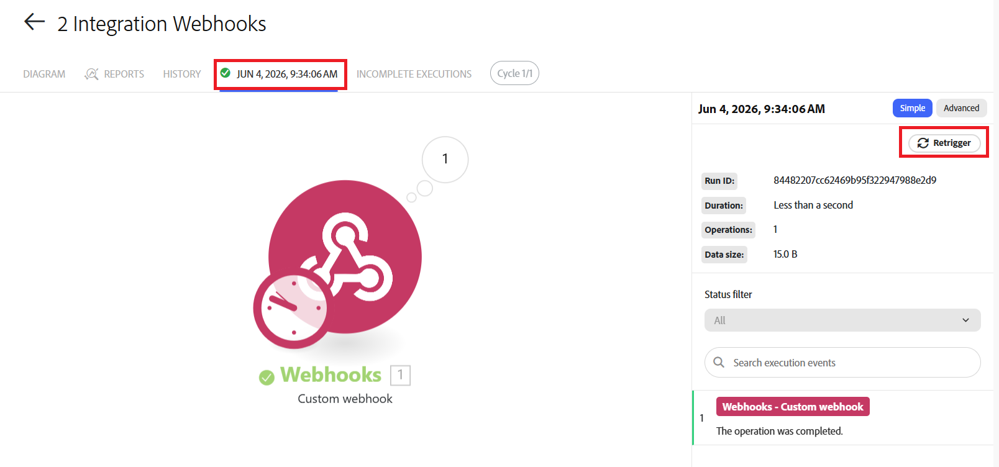

# Acionar novamente a execução de um cenário específico

É possível acionar novamente uma execução de cenário específica para processar os dados usando um blueprint de cenário atualizado ou para exibir seu fluxo de dados. Quando você aciona novamente uma execução, o cenário é executado usando os dados dessa execução.

Por exemplo, se você atualizar um cenário para adicionar uma ação como criar um problema, será possível acionar novamente uma execução que ocorreu antes da atualização. O cenário atualizado será executado usando o evento de acionamento do cenário original, mas incluirá a ação atualizada. Neste exemplo, o cenário cria um problema como parte da nova execução.

O reacionamento está disponível para cenários que têm acionadores de webhook e para cenários secundários.

Ao acionar novamente um cenário que usa um webhook, o evento do webhook original pode ser usado novamente, para que você não precise recriar o evento para acionar novamente o cenário.

Ao usar cenários encadeados, o reacionamento também pode ser aplicado a um cenário filho. O cenário filho pode ser acionado novamente usando os dados enviados do cenário pai na execução original, sem acionar novamente o pai.

Para mais informações sobre webhooks, consulte [Acionadores instantâneos (webhooks)](/help/workfront-fusion/references/modules/webhooks-reference.md).

Para obter mais informações sobre cenários de encadeamento, consulte [Encadear vários cenários juntos](/help/workfront-fusion/create-scenarios/plan-a-scenario/chain-scenarios.md).

## Requisitos de acesso

+++ Expanda para visualizar os requisitos de acesso da funcionalidade neste artigo.

<table style="table-layout:auto">
 <col> 
 <col> 
 <tbody> 
  <tr> 
   <td role="rowheader">Pacote do Adobe Workfront</td> 
   <td> 
Qualquer pacote de fluxo de trabalho do Adobe Workfront e qualquer pacote do Adobe Workfront Automation and Integration

Workfront Ultimate

Os pacotes Workfront Prime e Select, com uma compra adicional do Workfront Fusion.
 </td> 
  </tr> 
  <tr data-mc-conditions=""> 
   <td role="rowheader">Licenças do Adobe Workfront</td> 
   <td> 
Padrão

Trabalho ou maior
 </td> 
  </tr> 
  <tr> 
   <td role="rowheader">Produto</td> 
   <td>
   
Se sua organização tiver um pacote Workfront Select ou Prime, ele não inclui o Workfront Automation and Integration. É necessário comprar o Adobe Workfront Fusion.</li></ul>
   </td> 
  </tr>
 </tbody> 
</table>

Para obter mais detalhes sobre as informações contidas nesta tabela, consulte [Requisitos de acesso na documentação](/help/workfront-fusion/references/licenses-and-roles/access-level-requirements-in-documentation.md).

+++

## Acionar novamente uma execução

Você pode reacionar a execução de um cenário a partir do Diagrama do cenário, da área Histórico do cenário ou da página de execução do cenário específico.

### Acionar novamente uma execução do Diagrama de cenários

1. Clique na guia **[!UICONTROL Cenários]** no painel esquerdo.
1. Selecione o cenário que executou a execução que você deseja acionar novamente.

   O Diagrama do cenário é aberto.
1. Localize a execução que deseja acionar novamente na lista Execuções no lado direito da página.
1. Clique em **Acionar novamente** para esse cenário.

### Acionar novamente uma execução do Histórico de Cenários

1. Clique na guia **[!UICONTROL Cenários]** no painel esquerdo.
1. Selecione o cenário que executou a execução que você deseja acionar novamente.

   O Diagrama do cenário é aberto.

1. Clique na guia **Histórico** logo abaixo do nome do cenário.
1. Localize a execução que deseja acionar novamente. Você pode usar a pesquisa de texto completo para localizá-la, se necessário.
1. Clique em **Acionar novamente** para esse cenário.

### Acionar novamente um cenário na página de execução de cenário

1. Clique na guia **[!UICONTROL Cenários]** no painel esquerdo.
1. Selecione o cenário que executou a execução que você deseja acionar novamente.

   O Diagrama do cenário é aberto.
1. Localize a execução que deseja acionar novamente na lista Execuções no lado direito da página.
1. Clique na execução para abri-la.
1. Na página de execução, clique em **Acionar novamente**.

