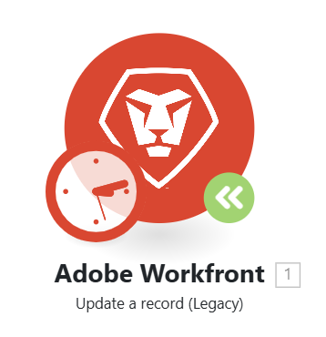

# Atualizar um módulo para uma nova versão

Como os aplicativos aos quais o Workfront Fusion se conecta podem atualizar ou lançar novas versões, às vezes é necessário que o Fusion libere módulos atualizados para esses aplicativos.

Se você vir um ícone verde do módulo de Atualização em um módulo em um cenário, o Workfront Fusion lançou uma nova versão desse módulo.

Você pode atualizar o módulo sem criar um novo cenário.

## Requisitos de acesso

+++ Expanda para visualizar os requisitos de acesso para a funcionalidade neste artigo.

<table style="table-layout:auto">
 <col> 
 <col> 
 <tbody> 
  <tr> 
   <td role="rowheader">Pacote do Adobe Workfront</td> 
   <td> 
Qualquer pacote de fluxo de trabalho do Adobe Workfront e qualquer pacote de Automação e Integração do Adobe Workfront

Workfront Ultimate

Workfront Prime e pacotes Select, com uma compra adicional do Workfront Fusion.
 </td> 
  </tr> 
  <tr data-mc-conditions=""> 
   <td role="rowheader">Licenças do Adobe Workfront</td> 
   <td> 
Standard

Trabalhar ou superior
 </td> 
  </tr> 
  <tr> 
   <td role="rowheader">Produto</td> 
   <td>
   
Se sua organização tiver um pacote Select ou Prime Workfront que não inclua a Automação e Integração do Workfront, ela deverá comprar o Adobe Workfront Fusion.</li></ul>
   </td> 
  </tr>
 </tbody> 
</table>

Para obter mais detalhes sobre as informações nesta tabela, consulte [Requisitos de acesso na documentação](/help/workfront-fusion/references/licenses-and-roles/access-level-requirements-in-documentation.md).

+++

## Atualizar um módulo do Workfront para uma nova versão

1. Clique no ícone **Atualizar módulo**  no módulo que você deseja atualizar para uma nova versão.
   
1. Escolha uma das seguintes opções:

   * Para selecionar um novo módulo para substituir este módulo (em vez de atualizar o módulo), clique em **Escolher novo** e prossiga conforme descrito em [Atualizar um módulo que não seja da Workfront para uma nova versão](#upgrade-a-non-workfront-module-to-a-new-version).
   * Para atualizar apenas este módulo, preservando a configuração do módulo, clique em **Atualizar**.
   * Para atualizar todos os módulos do Workfront no cenário, clique em **Atualizar tudo**.

1. Salve o cenário.

>[!NOTE]
>
>Se você atualizou módulos do Workfront, recomendamos abri-los e verificar a configuração do módulo.

## Atualizar um módulo que não seja do Workfront para uma nova versão

1. Clique no ícone **Atualizar módulo**  no módulo que você deseja atualizar para uma nova versão.
   
1. Clique em **Escolher novo**.
1. Selecione o módulo que você deseja substituir o módulo anterior.
1. Configure o módulo com as mesmas configurações do módulo existente.
1. Conecte o novo módulo ao cenário no mesmo lugar que o módulo existente.
1. Exclua o módulo antigo.
1. Salve o cenário.
