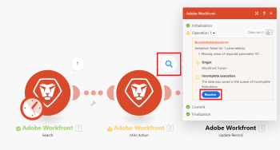

# Exibir e resolver execuções incompletas

A pasta [!UICONTROL Incomplete executions] armazena execuções de cenário que não foram concluídas com êxito devido a um erro. Cada execução incompleta armazenada pode ser resolvida manual ou automaticamente.

>[!NOTE]
>
>Por padrão, o armazenamento de execuções incompletas é desativado. Para habilitá-lo, habilite a opção [!UICONTROL Allow storing incomplete executions] nas configurações avançadas de cenário.
>
>Para obter mais informações sobre configurações de cenário, consulte [Definir configurações de cenário](/help/workfront-fusion/create-scenarios/config-scenarios-settings/configure-scenario-settings.md).

## Requisitos de acesso

+++ Expanda para visualizar os requisitos de acesso para a funcionalidade neste artigo.

Você deve ter o seguinte acesso para usar a funcionalidade neste artigo:

<table style="table-layout:auto">
 <col> 
 <col> 
 <tbody> 
  <tr> 
   <td role="rowheader">[!DNL Adobe Workfront] pacote</td> 
   <td> 
Qualquer
 </td> 
  </tr> 
  <tr data-mc-conditions=""> 
   <td role="rowheader">[!DNL Adobe Workfront] licença</td> 
   <td> 
Novo: [!UICONTROL Standard]

Ou

Atual: [!UICONTROL Work] ou superior
 </td> 
  </tr> 
  <tr> 
   <td role="rowheader">[!DNL Adobe Workfront Fusion] licença**</td> 
   <td>
   
Atual: nenhum requisito de licença [!DNL Workfront Fusion].

   
Ou

   
Herdados: Qualquer um 

   </td> 
  </tr> 
  <tr> 
   <td role="rowheader">Produto</td> 
   <td>
   
Novo:
 <ul><li>[!UICONTROL Select] ou plano do [!UICONTROL Prime] [!DNL Workfront]: sua organização deve comprar o [!DNL Adobe Workfront Fusion].</li><li>[!UICONTROL Ultimate] [!DNL Workfront] plano: [!DNL Workfront Fusion] está incluído.</li></ul>
   
Ou

   
Atual: sua organização deve comprar o [!DNL Adobe Workfront Fusion].

   </td> 
  </tr>
  <tr data-mc-conditions=""> 
   <td role="rowheader">Configurações de nível de acesso*</td> 
   <td> 
     
Você deve ser um administrador do [!DNL Workfront Fusion] para sua organização.

     
Você deve ser um administrador [!DNL Workfront Fusion] para sua equipe.

   </td> 
  </tr> 
   </td> 
  </tr> 
 </tbody> 
</table>

Para obter mais detalhes sobre as informações nesta tabela, consulte [Requisitos de acesso na documentação](/help/workfront-fusion/references/licenses-and-roles/access-level-requirements-in-documentation.md).

Para obter informações sobre [!DNL Adobe Workfront Fusion] licenças, consulte [[!DNL Adobe Workfront Fusion] licenças](/help/workfront-fusion/set-up-and-manage-workfront-fusion/licensing-operations-overview/license-automation-vs-integration.md).

+++

## Exibir execuções incompletas

Se um módulo encontrar um erro durante sua operação, uma nova execução incompleta será adicionada à pasta Incomplete executions. Cada execução incompleta contém o blueprint do cenário e todos os pacotes que podem ser mapeados no módulo com falha. A lista de execuções incompletas pode ser aberta clicando-se na guia [!UICONTROL Incomplete Executions] na página de detalhes do cenário.

<!--

-->

Para obter mais informações, consulte [Erros que resultam em execuções incompletas](#errors-resulting-into-incomplete-executions) neste artigo.

>[!NOTE]
>
>O limite de tamanho atual da pasta de execuções incompletas não resolvidas por organização é de 500 MB. Se sua organização exceder esse limite, você poderá ver o seguinte erro:
>
>`"There is NOT ENOUGH SPACE to add a bundle to the IEQ. The reason is: Too many incomplete executions."`
>
>Para obter mais informações, consulte [Habilitar perda de dados](/help/workfront-fusion/create-scenarios/config-scenarios-settings/configure-scenario-settings.md#enable-data-loss) no artigo Definir configurações de cenário.

## Resolver execuções incompletas na guia Execuções incompletas

Quando uma nova execução incompleta é armazenada, você pode resolvê-la da seguinte maneira:

1. Abra o cenário afetado.
1. Clique na guia **[!UICONTROL Incomplete Executions]**.
1. Localize a execução incompleta que você deseja resolver e clique em **[!UICONTROL Details]**.

## Resolver execuções incompletas na guia Histórico

Se quiser ver o log de todas as operações do módulo antes de tentar resolver a execução incompleta, você poderá resolver a execução incompleta na pasta [!UICONTROL History]:

1. Abra o cenário afetado.
1. Clique na guia **[!UICONTROL History]**.
1. Localize a execução com falha do cenário e clique em **[!UICONTROL Details]**.
1. Abra o registro do módulo em que todas as operações do módulo são exibidas.
1. Localize a operação com falha e clique em **[!UICONTROL Resolve]**:

   

## Opções relacionadas a execuções incompletas

As seguintes opções no painel [!UICONTROL Scenario settings] determinam se e como as execuções incompletas são armazenadas:

* Permitir o armazenamento de execuções incompletas
* Processamento sequencial
* Ativar perda de dados

Para obter mais informações sobre essas opções, consulte [Definir configurações de cenário](/help/workfront-fusion/create-scenarios/config-scenarios-settings/configure-scenario-settings.md).

## Erros que resultam em execuções incompletas

Há várias categorias de erros que resultam no armazenamento de execuções incompletas. Estas podem incluir:

* Erros de validação decorrentes de dados incompletos ou errôneos, principalmente por causa de um item ausente esperado para processar com êxito todos os dados que passam por um módulo.
* Erros que ocorrem devido à indisponibilidade do destino final devido a uma falha temporária ou de longa duração na conexão (por exemplo, durante a conexão com o servidor de email ou FTP remoto).

Se ocorrer um erro no primeiro módulo do cenário, a execução será interrompida imediatamente e nenhuma execução incompleta será armazenada.

Se ocorrer um erro em qualquer outro módulo e não houver nenhuma rota de manipulador de erros anexada, uma das seguintes situações ocorrerá:

* Se o tipo de erro for `ConnectionError`, `RateLimitError`, `OutOfSpaceError` ou `ModuleTimeoutError`, um registro de execução incompleto com repetição automática será armazenado.
* Se o tipo de erro for `DataError`, `InvalidConfigurationError`, `InvalidAccessTokenError`, `UnexpectedError`, `MaxFileSizeExceededError` ou `MaxResultsExceededError`, um registro de execução incompleto sem repetição automática será armazenado.
* Se o tipo de erro for diferente dos mencionados acima, a execução falhará.
