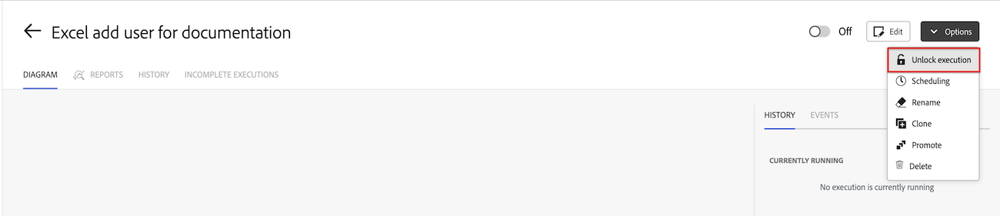

# Gerenciar cenários bloqueados

Em alguns casos, um cenário pode ser bloqueado temporariamente no Workfront Fusion. Os cenários bloqueados serão automaticamente desbloqueados em 2 a 4 horas. É possível desbloquear cenários manualmente, mas isso geralmente não é recomendado.

Os cenários podem ser bloqueados por vários motivos:

* O Workfront Fusion não oferece suporte ao processamento paralelo de cenários agendados. Esses cenários são bloqueados no início da execução do cenário e desbloqueados quando ele é concluído. Se a execução for interrompida, o cenário pode não ser desbloqueado. Isso pode ocorrer quando um usuário força manualmente o cenário ou quando há um problema no sistema.

* A equipe de engenharia do Workfront Fusion pode bloquear um cenário porque ele está causando desempenho ou outros problemas.

## Requisitos de acesso

+++ Expanda para visualizar os requisitos de acesso para a funcionalidade neste artigo.

<table style="table-layout:auto">
 <col> 
 <col> 
 <tbody> 
  <tr> 
   <td role="rowheader">Pacote do Adobe Workfront</td> 
   <td> 
Qualquer pacote de fluxo de trabalho do Adobe Workfront e qualquer pacote de Automação e Integração do Adobe Workfront

Workfront Ultimate

Workfront Prime e pacotes Select, com uma compra adicional do Workfront Fusion.
 </td> 
  </tr> 
  <tr data-mc-conditions=""> 
   <td role="rowheader">Licenças do Adobe Workfront</td> 
   <td> 
Standard

Trabalhar ou superior
 </td> 
  </tr> 
  <tr> 
   <td role="rowheader">Produto</td> 
   <td>
   
Se sua organização tiver um pacote Select ou Prime Workfront que não inclua a Automação e Integração do Workfront, ela deverá comprar o Adobe Workfront Fusion.</li></ul>
   </td> 
  </tr>
 </tbody> 
</table>

Para obter mais detalhes sobre as informações nesta tabela, consulte [Requisitos de acesso na documentação](/help/workfront-fusion/references/licenses-and-roles/access-level-requirements-in-documentation.md).

+++

## Desbloquear um cenário bloqueado

Cenários bloqueados serão desbloqueados de 2 a 4 horas a partir do momento em que foram bloqueados. É possível desbloquear um cenário manualmente antes de seu desbloqueio automático ser agendado.

>[!WARNING]
>
>Desbloquear um cenário manualmente pode causar erros nas execuções de um cenário. Recomendamos desbloquear manualmente os cenários somente quando um cenário está bloqueado devido à execução e interrupção de execuções como parte do design do cenário. Em outras circunstâncias, recomendamos que você aguarde até que o cenário seja desbloqueado automaticamente.

Para desbloquear manualmente um cenário bloqueado:

1. Vá para a página Detalhes do cenário do cenário bloqueado.
1. Clique em **[!UICONTROL Opções]** no canto superior direito da tela.
1. Selecione **[!UICONTROL Desbloquear execução]**.
1. Clique em **[!UICONTROL Desbloquear]**.
   
