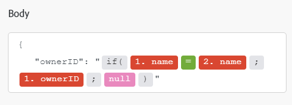

# Módulos do [!DNL Azure Active Directory]

Em um cenário do Adobe Workfront Fusion, é possível automatizar fluxos de trabalho que usam [!DNL Azure Active Directory], bem como conectá-lo a vários aplicativos e serviços de terceiros.

Para obter instruções sobre como criar um cenário, consulte os artigos em [Criar cenários: índice do artigo](/help/workfront-fusion/create-scenarios/create-scenarios-toc.md).

Para obter informações sobre módulos, consulte os artigos em [Módulos: índice do artigo](/help/workfront-fusion/references/modules/modules-toc.md).

## Requisitos de acesso

+++ Expanda para visualizar os requisitos de acesso da funcionalidade neste artigo.

<table style="table-layout:auto">
 <col> 
 <col> 
 <tbody> 
  <tr> 
   <td role="rowheader">Pacote do Adobe Workfront</td> 
   <td> 
Qualquer pacote de fluxo de trabalho do Adobe Workfront e qualquer pacote do Adobe Workfront Automation and Integration

Workfront Ultimate

Os pacotes Workfront Prime e Select, com uma compra adicional do Workfront Fusion.
 </td> 
  </tr> 
  <tr data-mc-conditions=""> 
   <td role="rowheader">Licenças do Adobe Workfront</td> 
   <td> 
Padrão

Trabalho ou maior
 </td> 
  </tr> 
  <tr> 
   <td role="rowheader">Licença do Adobe Workfront Fusion</td> 
   <td>
   
Baseado em operação: nenhum requisito de licença do Workfront Fusion

   
Baseado em conector (legado): Workfront Fusion for Work Automation and Integration 

   </td> 
  </tr> 
  <tr> 
   <td role="rowheader">Produto</td> 
   <td>
   
Se sua organização tiver um pacote Workfront Select ou Prime, ele não inclui o Workfront Automation and Integration. É necessário comprar o Adobe Workfront Fusion.</li></ul>
   </td> 
  </tr>
 </tbody> 
</table>

Para obter mais detalhes sobre as informações contidas nesta tabela, consulte [Requisitos de acesso na documentação](/help/workfront-fusion/references/licenses-and-roles/access-level-requirements-in-documentation.md).

Para obter informações sobre licenças do Adobe Workfront Fusion, consulte [Licenças do Adobe Workfront Fusion](/help/workfront-fusion/set-up-and-manage-workfront-fusion/licensing-operations-overview/license-automation-vs-integration.md).

+++

## Pré-requisitos

Para usar módulos [!DNL Azure Active Directory], você deve ter uma conta [!DNL Azure Active Directory].

## Informações da API [!DNL Azure Active Directory]

O conector do Azure Ative Diretory usa o seguinte:

<table style="table-layout:auto"> 
 <col> 
 <col> 
 <tbody> 
  <tr> 
   <td role="rowheader">Versão da API</td> 
   <td> v1.0 </td> 
  </tr> 
  <tr> 
   <td role="rowheader">Tag da API</td> 
   <td>v1.4.5</td> 
  </tr>
 </tbody> 
</table>

## Módulos do [!DNL Azure Active Directory] e seus campos

Ao configurar módulos do [!DNL Azure Active Directory], o Workfront Fusion exibe os campos listados abaixo. Junto com eles, outros campos do [!DNL Azure Active Directory] podem ser exibidos, dependendo de fatores como seu nível de acesso no aplicativo ou serviço. Um título em negrito em um módulo indica um campo obrigatório.

Se você vir o botão de mapa acima de um campo ou função, poderá usá-lo para definir variáveis e funções para esse campo. Para obter mais informações, consulte [Mapear informações de um módulo para outro no Adobe Workfront Fusion](/help/workfront-fusion/create-scenarios/map-data/map-data-from-one-to-another.md).

* [Acionadores](#triggers)
* [Ações](#actions)
* [Pesquisas](#searches)

### Acionadores

#### [!UICONTROL Observar registros] (agendado)

Este módulo de gatilho de sondagem (agendado) executa um cenário quando um registro em um objeto selecionado é criado desde a última execução agendada em [!DNL Azure Active Directory]. Também retorna todos os campos padrão associados ao registro ou aos registros, juntamente com quaisquer campos e valores personalizados que a conexão acesse.Você pode mapear essas informações em módulos subsequentes no cenário.

Ao configurar esse módulo, os campos a seguir são exibidos.

<table style="table-layout:auto"> 
 <col> 
 <col> 
 <tbody> 
  <tr> 
   <td role="rowheader">[!UICONTROL Connection]</td> 
   <td> 
Para obter instruções sobre como conectar sua conta do [!DNL Azure Active Directory] ao Workfront Fusion, consulte <a href="/help/workfront-fusion/create-scenarios/connect-to-apps/connect-to-fusion-general.md" class="MCXref xref" data-mc-variable-override="">Criar uma conexão com o Adobe Workfront Fusion - Instruções básicas</a>.
 </td> 
  </tr> 
  <tr> 
   <td role="rowheader">[!UICONTROL Type]</td> 
   <td>Selecione se deseja monitorar registros de Usuário ou registros de Grupo.</td> 
  </tr> 
  <tr> 
   <td role="rowheader">[!UICONTROL Número Máximo de Registros]</td> 
   <td>Insira ou mapeie o número máximo de registros que deseja que o módulo retorne durante cada ciclo de execução de cenário.</td> 
  </tr> 
 </tbody> 
</table>

### Ações

* [[!UICONTROL Ler Registro]](#read-record)
* [[!UICONTROL Criar Registro]](#create-record)
* [[!UICONTROL Chamada de API personalizada]](#custom-api-call)

#### [!UICONTROL Ler Registro]

Este módulo de ação lê dados de um único registro em [!DNL Azure Active Directory].

Especifique a ID do registro.

O módulo retorna a ID do registro e todos os campos associados, juntamente com quaisquer campos e valores personalizados que a conexão acessa. Você pode mapear essas informações em módulos subsequentes no cenário.

Você deve ter permissões suficientes para acessar o registro em [!DNL Azure Active Directory] para recuperar essas informações.

Ao configurar esse módulo, os campos a seguir são exibidos.

<table style="table-layout:auto">
 <col> 
 <col> 
 <tbody> 
  <tr> 
   <td role="rowheader">[!UICONTROL Connection]</td> 
   <td> 
Para obter instruções sobre como conectar sua conta do [!DNL Azure Active Directory] ao Workfront Fusion, consulte <a href="/help/workfront-fusion/create-scenarios/connect-to-apps/connect-to-fusion-general.md" class="MCXref xref" data-mc-variable-override="">Criar uma conexão com o Adobe Workfront Fusion - Instruções básicas</a>.
 </td> 
  </tr> 
  <tr> 
   <td role="rowheader">[!UICONTROL Record Type]</td> 
   <td>Selecione se você deseja ler um registro [!UICONTROL Usuário] ou um registro [!UICONTROL Grupo].</td> 
  </tr> 
  <tr> 
   <td role="rowheader">[!UICONTROL Outputs]</td> 
   <td>Selecione as informações que deseja incluir no pacote de saída deste módulo.</td> 
  </tr> 
  <tr> 
   <td role="rowheader">[!UICONTROL ID]</td> 
   <td>Insira ou mapeie a ID [!DNL Azure Active Directory] exclusiva do registro que você deseja que o módulo leia.</td> 
  </tr> 
 </tbody> 
</table>

#### [!UICONTROL Criar Registro]

Este módulo de ação cria um novo registro de usuário ou grupo.

Especifique o tipo do registro desejado.

O módulo retorna a ID do registro e todos os campos associados, juntamente com quaisquer campos e valores personalizados que a conexão acessa. Você pode mapear essas informações em módulos subsequentes no cenário.

Ao configurar esse módulo, os campos a seguir são exibidos.

<table style="table-layout:auto">
 <col> 
 <col> 
 <tbody> 
  <tr> 
   <td role="rowheader">[!UICONTROL Connection]</td> 
   <td> 
Para obter instruções sobre como conectar sua conta do [!DNL Azure Active Directory] ao Workfront Fusion, consulte <a href="/help/workfront-fusion/create-scenarios/connect-to-apps/connect-to-fusion-general.md" class="MCXref xref" data-mc-variable-override="">Criar uma conexão com o Adobe Workfront Fusion - Instruções básicas</a>.
 </td> 
  </tr> 
  <tr> 
   <td role="rowheader">[!UICONTROL Record Type]</td> 
   <td>Selecione se você deseja ler um registro [!UICONTROL Usuário] ou um registro [!UICONTROL Grupo].</td> 
  </tr> 
  <tr> 
   <td role="rowheader">[!UICONTROL Outros Campos]</td> 
   <td>Preencha esses campos para definir os valores do novo registro.</td> 
  </tr> 
 </tbody> 
</table>

#### [!UICONTROL Chamada de API personalizada]

Este módulo de ação permite fazer uma chamada autenticada personalizada para a API do [!DNL Azure Active Directory]. Dessa forma, você pode criar uma automação de fluxo de dados que não pode ser realizada pelos outros módulos do [!DNL Azure Active Directory].

Ao configurar esse módulo, os campos a seguir são exibidos.

<table style="table-layout:auto">
 <col> 
 <col> 
 <tbody> 
  <tr> 
   <td role="rowheader">[!UICONTROL Connection]</td> 
   <td> 
Para obter instruções sobre como conectar sua conta do [!DNL Azure Active Directory] ao Workfront Fusion, consulte <a href="/help/workfront-fusion/create-scenarios/connect-to-apps/connect-to-fusion-general.md" class="MCXref xref" data-mc-variable-override="">Criar uma conexão com o Adobe Workfront Fusion - Instruções básicas</a>.
 </td> 
  </tr> 
  <tr> 
   <td role="rowheader">[!UICONTROL URL]</td> 
   <td>Insira ou mapeie um caminho relativo a <code>https://graph.microsoft.com/{version}/{resource}?{query-parameters}</code></td> 
  </tr> 
  <tr> 
   <td role="rowheader">[!UICONTROL Method]</td> 
   <td> 
Selecione o método de solicitação HTTP necessário para configurar a chamada de API. Para obter mais informações, consulte <a href="/help/workfront-fusion/references/modules/http-request-methods.md" class="MCXref xref" data-mc-variable-override="">Métodos de solicitação HTTP</a>.
 </td> 
  </tr> 
  <tr> 
   <td role="rowheader">[!UICONTROL Headers]</td> 
   <td> 
Adicione os cabeçalhos da solicitação no formulário de um objeto JSON padrão.
 
Por exemplo, <code>{"Content-type":"application/json"}</code>
 </td> 
  </tr> 
  <tr> 
   <td role="rowheader">[!UICONTROL Query String]</td> 
   <td> 
Adicione a consulta para a chamada de API na forma de um objeto JSON padrão.
 
Por exemplo: <code>{"name":"something-urgent"}</code>
 </td> 
  </tr> 
  <tr> 
   <td role="rowheader">[!UICONTROL Body]</td> 
   <td> 
Adicione o conteúdo do corpo para a chamada de API na forma de um objeto JSON padrão.
 
Observação:  
Ao usar instruções condicionais, como <code>if</code> em seu JSON, coloque as aspas fora da instrução condicional.
 
     
Example: </b>"> 
      
  
 
     
 
 </td> 
  </tr> 
 </tbody> 
</table>

### Pesquisas

* [Procurar Usuários](#search-users)
* [Pesquisar Delta de Usuários/Grupos](#search-usersgroups-delta)

#### [!UICONTROL Pesquisar Usuários]

Este módulo de pesquisa procura registros em um objeto em [!DNL Azure Active Directory] que correspondam à consulta de pesquisa especificada. Você pode mapear essas informações em módulos subsequentes no cenário.

Ao configurar esse módulo, os campos a seguir são exibidos.

<table style="table-layout:auto">
 <col> 
 <col> 
 <tbody> 
  <tr> 
   <td role="rowheader">[!UICONTROL Connection]</td> 
   <td> 
Para obter instruções sobre como conectar sua conta do [!DNL Azure Active Directory] ao Workfront Fusion, consulte <a href="/help/workfront-fusion/create-scenarios/connect-to-apps/connect-to-fusion-general.md" class="MCXref xref" data-mc-variable-override="">Criar uma conexão com o Adobe Workfront Fusion - Instruções básicas</a>.
 </td> 
  </tr> 
  <tr data-mc-conditions=""> 
   <td role="rowheader">[!UICONTROL Critérios de Pesquisa]</td> 
   <td> 
Informe os critérios que deseja utilizar na pesquisa.
 
Para obter informações sobre os parâmetros a serem usados, como "[!UICONTROL $filter]", consulte <a href="https://docs.microsoft.com/en-us/graph/query-parameters">Usar parâmetros de consulta para personalizar respostas</a> na documentação da API [!DNL Microsoft].
 </td> 
  </tr> 
  <tr data-mc-conditions=""> 
   <td role="rowheader">[!UICONTROL Outputs]</td> 
   <td>Selecione as informações que deseja incluir no pacote de saída deste módulo.</td> 
  </tr> 
  <tr data-mc-conditions=""> 
   <td role="rowheader">[!UICONTROL Contagem máxima de registros]</td> 
   <td>Insira ou mapeie o número máximo de registros que deseja que o módulo retorne durante cada ciclo de execução de cenário.</td> 
  </tr> 
 </tbody> 
</table>

#### [!UICONTROL Intervalo de Usuários/Grupos de Pesquisa]

Este módulo de pesquisa procura registros em [!DNL Azure AD] que foram criados, atualizados ou excluídos. Você pode mapear essas informações em módulos subsequentes no cenário.

<table style="table-layout:auto">
 <col> 
 <col> 
 <tbody> 
  <tr> 
   <td role="rowheader">[!UICONTROL Connection]</td> 
   <td> 
Para obter instruções sobre como conectar sua conta do [!DNL Azure Active Directory] ao Workfront Fusion, consulte <a href="/help/workfront-fusion/create-scenarios/connect-to-apps/connect-to-fusion-general.md" class="MCXref xref" data-mc-variable-override="">Criar uma conexão com o Adobe Workfront Fusion - Instruções básicas</a>.
 </td> 
  </tr> 
  <tr data-mc-conditions=""> 
   <td role="rowheader">[!UICONTROL Limit]</td> 
   <td>Insira ou mapeie o número máximo de registros que deseja que o módulo retorne durante cada ciclo de execução de cenário.</td> 
  </tr> 
 </tbody> 
</table>
