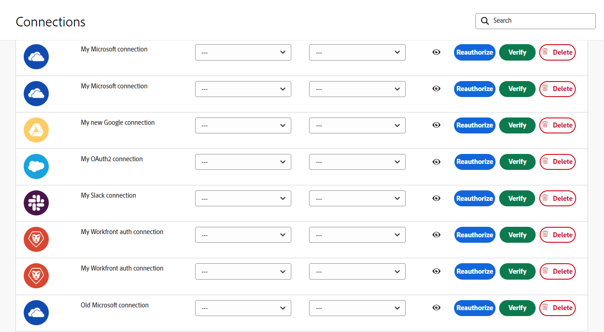

# Metadados da conexão

O Fusion usa metadados para identificar atributos importantes de uma conexão.

Os metadados de conexão podem ser definidos ao criar uma nova conexão. Esses atributos estão na mesma caixa de diálogo usada para configurar uma conexão:

Os usuários do Fusion podem exibir e editar conexões na área Conexões.

## Tipo de ambiente

As conexões de fusão podem ser usadas por sistemas de produção e não produção. Você pode marcar o tipo de ambiente ao qual uma conexão se conecta, o que ajuda a proteger ambientes de produção.

O tipo de ambiente, como outros metadados de conexão, é usado apenas para fins informativos. Os usuários são responsáveis por definir com precisão esse atributo e usar uma conexão com o ambiente correto em um cenário.

## Tipo de autenticação

As conexões de fusão podem ser usadas para contas de serviço e contas pessoais. Contas de serviço são usadas para autenticação quando um cenário é automatizado como Fusion. Contas pessoais são autenticações baseadas em uma pessoa específica. O tipo de autenticação usado depende dos requisitos do cenário. Contas pessoais devem ser usadas para ações automatizadas do usuário. Por exemplo, se um cenário do Fusion automatiza a aprovação por uma pessoa específica, o tipo de autenticação deve ser para essa pessoa. Caso contrário, o Fusion está agindo como Fusion e o tipo deve ser Conta de Serviço.

O tipo de autenticação, como outros metadados de conexão, é usado apenas para fins informativos. Os usuários são responsáveis por definir com precisão esse atributo e usar o tipo correto de conexão em um cenário.

Para obter mais informações sobre tipos de autenticação, consulte [Autenticação](https://developer.adobe.com/developer-console/docs/guides/authentication/) no guia de Autenticação do Adobe.

## Recursos

* Para obter instruções sobre como gerenciar metadados de conexão, consulte [Gerenciar conexões](/help/workfront-fusion/create-scenarios/connect-to-apps/manage-connections.md).
