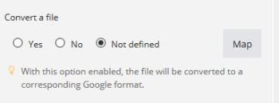

# Tipos de dados de item

Você pode conter os tipos de itens listados abaixo em um pacote.

Para obter informações sobre quais tipos de itens [!DNL Workfront Fusion] permitem a conversão entre si, consulte [Coerção de tipo](/help/workfront-fusion/references/mapping-panel/data-types/type-coercion.md).

<table style="table-layout:auto">
 <col> 
 <col> 
 <tbody> 
  <tr> 
   <td role="rowheader"> 
Texto
 </td> 
   <td> 
O tipo de item mais comum. Para alguns itens de texto, o [!DNL Adobe Workfront Fusion] verifica se o comprimento máximo ou mínimo permitido foi atingido ou se o item executa a validação de formato (email, URL ou nome de arquivo).
 </td> 
  </tr> 
  <tr> 
   <td role="rowheader"> 
Número
 </td> 
   <td> 
Para alguns itens numéricos, [!DNL Workfront Fusion] pode validar a entrada para um intervalo especificado (o valor mínimo ou máximo permitido).
 </td> 
  </tr> 
  <tr> 
   <td role="rowheader"> 
Booleano (Sim/Não)
 </td> 
   <td> 
Esse tipo é usado para itens com apenas dois valores possíveis: verdadeiro ou falso. 
 
Ao definir módulos, o tipo Booleano pode aparecer de duas formas diferentes:
 
    <ul> 
     <li> 
A caixa de seleção obrigatória é exibida caso o campo seja obrigatório e deva ser preenchido.
 
  
 </li> 
     <li> 
Campos opcionais que podem ser deixados em branco são exibidos como uma caixa de seleção, permitindo a seleção entre três valores: <code>Yes</code>, <code>No</code> e <code>Not defined</code> (padrão).
 
  
 </li> 
    </ul> 
Você pode clicar em <strong>[!UICONTROL Map]</strong> se precisar mapear o valor para um item de outro módulo.
 </td> 
  </tr> 
  <tr> 
   <td role="rowheader"> 
Data
 </td> 
   <td> 
As datas são inseridas no formato de data ISO 8601, por exemplo, <code>2015-09-18T11:58Z</code>. Você pode alterar o fuso horário nas configurações do perfil. 
 
Se você clicar em um campo que requer uma data, um calendário pop-up será exibido nas configurações do módulo. O tempo não é necessário para alguns itens.
 
Os valores dos itens de Data são formatados usando o fuso horário local e da Web selecionado no seu perfil. É possível exibir a versão ISO 8601 do valor de um item de data, passando o mouse sobre o item.
 
Observação: se o valor ISO não for exibido, o item provavelmente é um texto, não uma data.
 
A hora é inserida no formato <code>hours:minutes:seconds</code>, por exemplo, <code>14:03:52</code>.
 </td> 
  </tr> 
  <tr> 
   <td role="rowheader"> 
Buffer (dados binários)
 </td> 
   <td> 
O conteúdo do arquivo geralmente é enviado como conteúdo do tipo Buffer (conteúdo de imagem, arquivo de vídeo e outros). Em alguns casos, dados de texto são incluídos nesse tipo (por exemplo, um arquivo de texto). O [!DNL Workfront Fusion] pode converter automaticamente dados de texto em código binário em texto e texto em dados de texto em código binário. Para obter mais informações, consulte <a href="/help/workfront-fusion/create-scenarios/map-data/map-files.md" class="MCXref xref">Arquivos de mapa</a>.
 </td> 
  </tr> 
  <tr> 
   <td role="rowheader"> 
Coleção
 </td> 
   <td> 
Uma coleção é um item que consiste em vários subitens. O item Remetente em uma mensagem de email é um exemplo de uma coleção: ele contém o nome do remetente (tipo de texto) e o endereço de email do remetente (tipo de texto).
 </td> 
  </tr> 
  <tr> 
   <td role="rowheader"> 
Selecionar (menu)
 </td> 
   <td> 
Ao definir as configurações do módulo, é possível selecionar entre vários itens do mesmo tipo. Um exemplo é o menu de seleção de pasta nas configurações dos módulos [!DNL Dropbox]. 
 
Ao configurar módulos, o menu de seleção pode aparecer de duas formas:
 
 
Se for possível fazer várias seleções, vários itens com caixas de seleção serão exibidos.
 
  
 
 
Se apenas uma opção for possível, um menu suspenso será exibido.
 
  
 
Se você precisar mapear um item de outro módulo, use o botão <strong>Mapear</strong>. Esse botão abre um campo de texto em vez do menu de seleção. Para obter mais informações sobre mapeamento, consulte <a href="/help/workfront-fusion/get-started-with-fusion/understand-fusion/mapping-overview.md" class="MCXref xref">Visão geral do mapeamento</a>.
 </td> 
  </tr> 
  <tr> 
   <td role="rowheader"> 
Matriz
 </td> 
   <td> 
Você pode usar o tipo de matriz para trabalhar com vários valores do mesmo tipo, incluindo coleções. Um exemplo são os módulos [!UICONTROL Email]: eles retornam uma matriz de anexos e cada anexo contém nome, conteúdo, tamanho e assim por diante. Para obter mais informações, consulte <a href="/help/workfront-fusion/create-scenarios/map-data/map-an-array.md" class="MCXref xref">Mapear uma matriz ou elemento de matriz</a>.
 </td> 
  </tr> 
  <tr> 
   <td role="rowheader"> 
Validação
 </td> 
   <td> 
[!DNL Workfront Fusion] executar a validação em cada tipo de item. Se um item não passar na validação, o módulo parará de ser processado devido a um erro de dados. Para obter mais informações, consulte <a href="/help/workfront-fusion/references/errors/error-processing.md" class="MCXref xref">Tipos de erro </a>. 
 </td> 
  </tr> 
 </tbody> 
</table>
