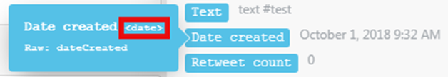
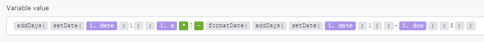
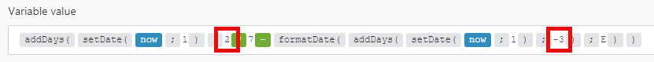
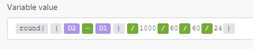
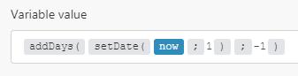
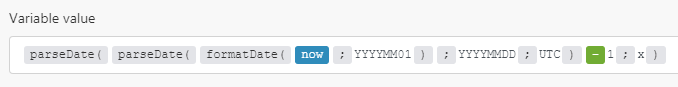
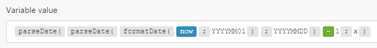

# Funções de data e hora

## Variáveis

### now

Obtém a hora atual no formato AAAA-MM-DD-hh:mm:ss.

### carimbo de data e hora

Obtém a hora atual como um carimbo de data/hora Unix.

## Funções

### [!UICONTROL addSeconds (data; número)]

Retorna uma nova data como resultado da adição de um determinado número de segundos a uma data. Para subtrair segundos, informe um número negativo.

>[!BEGINSHADEBOX]

**Exemplos:**

* `addSeconds(2016-12-08T15:55:57.536Z;2)`

  Retorna 2016-12-08T15:55:59.536Z

* `addSeconds(2016-12-08T15:55:57.536Z;-2)`

  Retorna 2016-12-08T15:55:55.536Z

>[!ENDSHADEBOX]

### [!UICONTROL addMinutes (data; número)] {#addminutes-date-number}

Retorna uma nova data como resultado da adição de um determinado número de minutos a uma data. Para subtrair minutos, informe um número negativo.

>[!BEGINSHADEBOX]

**Exemplos:**

* `addMinutes(2016-12-08T15:55:57.536Z;2)`

  Retorna 2016-12-08T15:57:57.536Z

* `addMinutes(2016-12-08T15:55:57.536Z;-2)`

  Retorna 2016-12-08T15:53:57.536Z

>[!ENDSHADEBOX]

### [!UICONTROL addHours (data; número)] {#addhours-date-number}

Retorna uma nova data como resultado da adição de um determinado número de horas a uma data. Para subtrair horas, informe um número negativo.

>[!BEGINSHADEBOX]

**Exemplos:**

* `addHours(2016-12-08T15:55:57.536Z; 2)`

  Retorna 2016-12-08T17:55:57.536Z

* `addHours(2016-12-08T15:55:57.536Z;-2)`

  Retorna 2016-12-08T13:55:57.536Z

>[!ENDSHADEBOX]

### [!UICONTROL addDays (data; número)] {#adddays-date-number}

Retorna uma nova data como resultado da adição de um determinado número de dias a uma data. Para subtrair dias, informe um número negativo.

>[!BEGINSHADEBOX]

**Exemplos:**

* `addDays(2016-12-08T15:55:57.536Z;2)`

  Retorna 2016-12-10T15:55:57.536Z

* `addDays(2016-12-08T15:55:57.536Z;-2)`

  Retorna 2016-12-6T15:55:57.536Z

>[!ENDSHADEBOX]

### [!UICONTROL addMonths (data; número)]

Retorna uma nova data como resultado da adição de um determinado número de meses a uma data. Para subtrair meses, informe um número negativo.

>[!BEGINSHADEBOX]

**Exemplos:**

* `addMonths(2016-08-08T15:55:57.536Z;2)`

  Retorna 2016-10-08T15:55:57.536Z

* `addMonths(2016-08-08T15:55:57.536Z;-2)`

  Retorna 2016-06-08T15:55:57.536Z

>[!ENDSHADEBOX]

### [!UICONTROL addYears (data; número)]

Retorna uma nova data como resultado da adição de um determinado número de anos a uma data. Para subtrair anos, informe um número negativo.

>[!BEGINSHADEBOX]

**Exemplos:**

* `addYears(2016-08-08T15:55:57.536Z;2)`

  Retorna 2018-08-08T15:55:57.536Z

* `addYears(2016-12-08T15:55:57.536Z; -2)`

  Retorna 2014-08-08T15:55:57.536Z

>[!ENDSHADEBOX]

### [!UICONTROL setSecond (data; número)]

Esta função retorna uma nova data com os segundos especificados em parâmetros.

Especifique um número de 0 a 59. Se o número estiver fora desse intervalo, a função retornará um segundo do minuto anterior (para um número negativo) ou do minuto subsequente (para um número positivo).

Se você precisar especificar um número fora do intervalo, recomendamos usar [!UICONTROL  addSeconds], conforme descrito acima na seção [addSeconds (date; number)](#addseconds-date-number).

>[!BEGINSHADEBOX]

**Exemplos:**

* `setSecond(2015-10-07T11:36:39.138Z;10)`

  Retorna 2015-10-07T11:36:10.138Z

* `setSecond(2015-10-07T11:36:39.138Z; 61)`

  Retorna 2015-10-07T11:37:01.138Z

>[!ENDSHADEBOX]

### [!UICONTROL setMinute (data; número)]

Esta função retorna uma nova data com os minutos especificados em parâmetros.

Especifique um número de 0 a 59. Se o número estiver fora desse intervalo, a função retornará um minuto da hora anterior (para um número negativo) ou da hora subsequente (para um número positivo).

Se você precisar especificar um número fora do intervalo, recomendamos usar addMinutes, conforme descrito acima em [addMinutes (date; number)](#addminutes-date-number).

>[!BEGINSHADEBOX]

**Exemplos:**

* `setMinute(2015-10-07T11:36:39.138Z;10)`

  Retorna 2015-10-07T11:10:39.138Z

* `setMinute(2015-10-07T11:36:39.138Z;61)`

  Retorna 2015-10-07T12:01:39.138Z

>[!ENDSHADEBOX]

### [!UICONTROL setHour (data; número)]

Esta função retorna uma nova data com a hora especificada nos parâmetros.

Especifique um número de 0 a 23. Se o número estiver fora desse intervalo, a função retornará uma hora do dia anterior (para um número negativo) ou do dia subsequente (para um número positivo).

Se você precisar especificar um número fora do intervalo, recomendamos usar addHours, conforme descrito acima em [addHours (date; number)](#addhours-date-number).

>[!BEGINSHADEBOX]

**Exemplos:**

* `setHour(2015-08-07T11:36:39.138Z;6)`

  Retorna 2015-08-07T06:36:39.138Z

* `setHour(2015-08-07T11:36:39.138;-6)`

  Retorna 2015-08-06T18:36:39.138Z

>[!ENDSHADEBOX]

### [!UICONTROL setDay (data; número/nome do dia em inglês)]

Esta função retorna uma nova data com o dia especificado nos parâmetros.

Você pode usar essa função para definir o dia da semana, com Domingo como 1 e Sábado como 7. Se você especificar um número de 1 a 7, a data resultante estará na semana atual (de domingo a sábado). Se o número estiver fora desse intervalo, a função retornará um dia da semana anterior (para um número negativo) ou da semana subsequente (para um número positivo).

Se você precisar especificar um número fora do intervalo, recomendamos usar addDays, conforme descrito acima em [addDays (date; number)](#adddays-date-number).

>[!BEGINSHADEBOX]

**Exemplos:**

* `setDay(2018-06-27T11:36:39.138Z;Monday)`

  Retorna 25T11:36:39.138Z/2018

* `setDay(2018-06-27T11:36:39.138Z;1)`

  Retorna 24/06/2018:36:39.138Z

* `setDay(2018-06-27T11:36:39.138Z;7)`

  Retorna 30T11:36:39.138Z/2018

>[!ENDSHADEBOX]

### [!UICONTROL setDate (data; número)]

Esta função retorna uma nova data com o dia do mês especificado em parâmetros.

Especifique um número de 1 a 31. Se o número estiver fora desse intervalo, a função retornará um dia do mês anterior (para um número negativo) ou do mês seguinte (para um número positivo).

>[!BEGINSHADEBOX]

**Exemplos:**

* `setDate(2015-08-07T11:36:39.138Z;5)`

  Retorna 2015-08-05T11:36:39.138Z

* `setDate(2015-08-07T11:36:39.138Z;32)`

  Retorna 2015-09-01T11:36:39.138Z

>[!ENDSHADEBOX]

### [!UICONTROL setMonth (data; número/nome do mês em inglês)]

Esta função retorna uma nova data com o mês especificado em parâmetros.

Especifique um número de 1 a 12. Se o número estiver fora desse intervalo, a função retornará o mês do ano anterior (para um número negativo) ou o ano subsequente (para um número positivo).

>[!BEGINSHADEBOX]

**Exemplos:**

* `setMonth(2015-08-07T11:36:39.138Z;5)`

  Retorna 2015-05-07T11:36:39.138Z

* `setMonth(2015-08-07T11:36:39.138Z;17)`

  Retorna 2016-05-07T11:36:39.138Z

* `setMonth(2015-08-07T11:36:39.138Z;january)`

  Retorna 2015-01-07T12:36:39.138Z

>[!ENDSHADEBOX]

### [!UICONTROL setYear (data; número)]

Retorna uma nova data com o ano especificado em parâmetros.

>[!BEGINSHADEBOX]

**Exemplo:**

* `setYear(2015-08-07T11:36:39.138Z;2017)`

  Retorna 2017-08-07T11:36:39.138Z

>[!ENDSHADEBOX]

### [!UICONTROL formatDate (data; formato; [fuso horário])]

Use esta função quando tiver um valor Date, como `12-10-2021 20:30`, que você deseja formatar como um valor Text, como `Dec 10, 2021 8:30 PM`.

Isso é útil, por exemplo, quando é necessário alterar o formato de data de um aplicativo ou serviço da Web para o de um aplicativo ou serviço da Web conectado no mesmo cenário.

Para obter mais informações, consulte Data e Texto no artigo [Tipos de dados do item](/help/workfront-fusion/references/mapping-panel/data-types/item-data-types.md).

#### Parâmetros

<table style="table-layout:auto"> 
 <col> 
 <col> 
 <col> 
 <thead> 
  <tr> 
   <th>Parâmetro</th> 
   <th>Tipo de dados esperado* </th> 
   <th>O que faz</th> 
  </tr> 
 </thead> 
 <tbody> 
  <tr> 
   <td>[!UICONTROL data] </td> 
   <td>Data </td> 
   <td> <p>Converte um valor Date em um valor Text. </p> </td> 
  </tr> 
  <tr> 
   <td>[!UICONTROL formato] </td> 
   <td>Texto </td> 
   <td> <p>Permite especificar um formato usando tokens de formatação de data/hora. Para obter mais informações, consulte <a href="/help/workfront-fusion/references/mapping-panel/functions/tokens-for-date-and-time-formatting.md" class="MCXref xref">Tokens para formatação de data e hora</a>.</p> <p class="example" data-mc-autonum="<b>Example: </b>"><span class="autonumber"><span><b>Exemplo: </b></span></span><code>DD.MM.YYYY HH:mm</code> </p> </td> 
  </tr> 
  <tr> 
   <td>[!UICONTROL fuso horário] </td> 
   <td>Texto </td> 
   <td> <p>(Opcional) Permite especificar o fuso horário usado para a conversão. </p> <p>Para obter a lista de fusos horários reconhecidos, consulte a coluna "TZ database name" na Wikipédia <a href="https://en.wikipedia.org/wiki/List_of_tz_database_time_zones">List of tz database time zones</a>. Somente os valores listados nesta coluna são reconhecidos pela função como um fuso horário válido. Qualquer outro valor é ignorado e o fuso horário de Cenários especificado em seu Perfil é usado. </p> <p>Se você omitir esse parâmetro, o fuso horário de Cenários especificado nas configurações de Perfil será aplicado. </p> <p class="example" data-mc-autonum="<b>Example: </b>"><span class="autonumber"><span><b>Exemplo: </b></span></span><code>Europe/Prague</code>, <code>UTC</code></p> </td> 
  </tr> 
 </tbody> 
</table>

Se um tipo diferente for fornecido, a coerção de tipo será aplicada. Para obter mais informações, consulte [Coerção de tipo](/help/workfront-fusion/references/mapping-panel/data-types/type-coercion.md).

#### Valor e tipo de retorno

A função `formatDate` retorna uma representação de texto do valor de Data especificado de acordo com o formato e o fuso horário especificados. O tipo de dados é Texto.

>[!BEGINSHADEBOX]

**Exemplos:** O Cenário e o fuso horário da Web foram definidos como `Europe/Prague` nesses exemplos.



* `formatDate(1. Date created;MM/DD/YYYY)`

  Devoluções em 01/10/2018

* `formatDate(1. Date created; YYYY-MM-DD hh:mm A)`

  Devoluções 2018-10-01 09:32 AM

* `formatDate(1. Date created;DD.MM.YYYY HH:mm;UTC)`

  Retorna 01.10.2018 07:32

* `formatDate(now;DD.MM.YYYY HH:mm)`

  Retorna 19.03.2019 15:30

>[!ENDSHADEBOX]

### [!UICONTROL parseDate (texto; formato; [fuso horário])]

Use esta função quando tiver um valor de Texto representando uma data (como `12-10-2019 20:30` ou `Aug 18, 2019 10:00 AM`) e quiser convertê-lo (analisar) em um valor de Data (uma representação binária legível por máquina). Para obter mais informações, consulte Data e Texto no artigo [Tipos de dados do item](/help/workfront-fusion/references/mapping-panel/data-types/item-data-types.md).

#### Parâmetros

A segunda coluna indica o tipo esperado. Se um tipo diferente for fornecido, a coerção de tipo será aplicada. Para obter mais informações, consulte [Coerção de tipo](/help/workfront-fusion/references/mapping-panel/data-types/type-coercion.md).

<table style="table-layout:auto"> 
 <col> 
 <col> 
 <col> 
 <thead> 
  <tr> 
   <th>Parâmetro</th> 
   <th>Tipo de dados esperado* </th> 
   <th>O que faz</th> 
  </tr> 
 </thead> 
 <tbody> 
  <tr> 
   <td>[!UICONTROL texto] </td> 
   <td>Texto </td> 
   <td> <p>Converte um valor Date em um valor Text. </p> </td> 
  </tr> 
  <tr> 
   <td>[!UICONTROL formato] </td> 
   <td>Texto </td> 
   <td> <p>Permite especificar um formato usando tokens de formatação de data/hora. Para obter mais informações, consulte <a href="/help/workfront-fusion/references/mapping-panel/functions/tokens-for-date-and-time-formatting.md" class="MCXref xref">Tokens para formatação de data e hora</a>.</p> <p class="example" data-mc-autonum="<b>Example: </b>"><span class="autonumber"><span><b>Exemplo: </b></span></span><code>DD.MM.YYYY HH:mm</code> </p> </td> 
  </tr> 
  <tr> 
   <td>[!UICONTROL fuso horário] </td> 
   <td>Texto </td> 
   <td> <p>(Opcional) Permite especificar o fuso horário usado para a conversão. </p> <p>Para obter a lista de fusos horários reconhecidos, consulte a coluna "TZ database name" na Wikipédia <a href="https://en.wikipedia.org/wiki/List_of_tz_database_time_zones">List of tz database time zones</a>. Somente os valores listados nesta coluna são reconhecidos pela função como um fuso horário válido. Qualquer outro valor é ignorado e o fuso horário de Cenários especificado em seu Perfil é usado. </p> <p>Se você omitir esse parâmetro, o fuso horário de Cenários especificado nas configurações de Perfil será aplicado.</p> <p class="example" data-mc-autonum="<b>Example: </b>"><span class="autonumber"><span><b>Exemplo: </b></span></span><code>Europe/Prague</code>, <code>UTC</code></p> </td> 
  </tr> 
 </tbody> 
</table>

Se um tipo diferente for fornecido, a coerção de tipo será aplicada. Para obter mais informações, consulte [Coerção de tipo](/help/workfront-fusion/references/mapping-panel/data-types/type-coercion.md).

#### Valor e tipo de retorno

Essa função converte uma sequência de caracteres de texto em uma data, de acordo com o formato e o fuso horário especificados. O tipo de dados do valor é Data.

>[!BEGINSHADEBOX]

**Exemplos:** Nos exemplos a seguir, o valor de Data retornado é expresso de acordo com a ISO 8601, mas o tipo de dados do resultado é Data.

* `parseDate(2016-12-28;YYYY-MM-DD)`

  Retorna 2016-12-28T00:00:00.000Z

* `parseDate(2016-12-28 16:03;YYYY-MM-DD HH:mm)`

  Retorna 2016-12-28T16:03:00.000Z

* `parseDate(2016-12-28 04:03 pm; YYYY-MM-DD hh:mm a)`

  Retorna 2016-12-28T16:03:06.000Z

* `parseDate(1482940986;X)`

  Retorna 2016-12-28T16:03:06.000Z

>[!ENDSHADEBOX]

### [!UICONTROL diferençaData (Data1; Data2; Unidade)]

Retorna um número que representa a diferença nas duas datas, expressas na unidade especificada.

A Data2 é subtraída da Data1.

Use um dos seguintes valores de tempo para o parâmetro `unit`:

* milissegundos
* segundos
* minutos
* horas
* dias
* semanas
* meses

Se nenhuma unidade for especificada, a função retornará a diferença em milissegundos.

>[!BEGINSHADEBOX]

**Exemplos:**

* `dateDifference(2021-05-11T18:10:00.000Z;2021-05-11T18:00:00.000Z)`

  Retorna `600,000`

* `dateDifference(2021-05-11T18:10:00.000Z;2021-05-11T18:00:00.000Z;hours)`

  Retorna `4`

* `dateDifference2021-06-11T18:10:00.000Z;2021-05-11T18:00:00.000Z;months)`

  Retorna `1`

>[!ENDSHADEBOX]

### Exemplos adicionais

#### Como calcular o n-ésimo dia da semana no mês

Esta seção é adaptada para [!DNL Workfront Fusion] a partir da página da Web [!DNL Exceljet], que explica como obter o n-ésimo dia da semana em um mês.

Se você precisar calcular uma data correspondente ao n-ésimo dia da semana no mês (por exemplo, primeira terça-feira, terceira sexta-feira e assim por diante), poderá usar a seguinte fórmula:



```
{{addDays(setDate(1.date; 1); 1.n * 7 - formatDate(addDays(setDate(1.date; 1); "-" + 1.dow); "E"))}}
```

A fórmula contém os seguintes itens:

<table style="table-layout:auto"> 
 <col> 
 <col> 
 <tbody> 
  <tr> 
   <td><code>1.n</code> </td> 
   <td> <p> Dia n:</p> 
    <ul> 
     <li><code>1</code> para 1ª terça-feira</li> 
     <li><code>2</code> para a 2ª terça-feira</li> 
     <li><code>3</code> para a 3ª terça-feira e assim por diante</li> 
    </ul> </td> 
  </tr> 
  <tr> 
   <td><code>2.dow</code> </td> 
   <td> <p> dia da semana:</p> 
    <ul> 
     <li><code>1</code> para segunda-feira</li> 
     <li><code>2</code> para terça-feira</li> 
     <li><code>3</code> para quarta-feira</li> 
     <li><code>4</code> para quinta-feira</li> 
     <li><code>5</code> para sexta-feira</li> 
     <li><code>6</code> para sábado</li> 
     <li><code>7</code> para domingo</li> 
    </ul> </td> 
  </tr> 
  <tr> 
   <td><code>1.date</code> </td> 
   <td> <p> A data determina o mês. Para calcular o dia n da semana no mês atual, use a variável <code>now</code>.</p> </td> 
  </tr> 
 </tbody> 
</table>

Caso queira calcular apenas um caso específico, por exemplo, a cada segunda quarta-feira, você pode substituir os itens `1.n` e `2.dow` na fórmula por números correspondentes. Para a segunda quarta-feira do mês atual, você usaria os seguintes valores:

* `1.n` = `2`
* `1.dow` = `3`
* `1.date` = `now`



#### Explicação:

* `setDate(now;1)` retorna o primeiro dia do mês atual
* `formatDate(....;E)` retorna o dia da semana (1, 2, ... 6)

### Como calcular dias entre datas

Uma possibilidade é empregar a seguinte expressão:



```
{{round((2.value - 1.value) / 1000 / 60 / 60 / 24)}}
```

>[!NOTE]
>
>* Os valores de `D1` e `D2` devem ser valores do tipo Data. Se forem valores do tipo String (por exemplo, 20.10.2018), use a função `parseDate()` para convertê-los em valores do tipo Date.
>
>* A função `round()` é usada para casos em que uma das datas está dentro do período de horário de verão e a outra não. Nesses casos, a diferença em horas é de uma hora a menos ou mais. Você pode dividi-la por 24 para um resultado não inteiro. Você perde uma hora de verão. Arredondar nivela para que você não tenha uma porcentagem

#### Como calcular o último dia/milissegundo do mês

Ao especificar um intervalo de datas, por exemplo, em um módulo de pesquisa, se o intervalo abranger todo o mês anterior como um intervalo fechado (o intervalo que inclui ambos os pontos de limite), será necessário calcular o último dia do mês.

2019-09-01 ≤ D ≤ 2019-09-30

A fórmula abaixo mostra uma maneira de calcular o último dia do mês anterior:



```
{{addDays(setDate(now; 1); -1)}}
```

Em alguns casos, é necessário calcular não apenas o último dia do mês, mas literalmente seu último milissegundo:

2019-09-01T00:00:00.000Z ≤ D ≤ 2019-09-30T23:59:59.999Z

Esta fórmula mostra uma maneira de calcular o último milissegundo do mês anterior:



```
{{parseDate(parseDate(formatDate(now; "YYYYMM01"); "YYYYMMDD"; "UTC") - 1; "x")}}
```

Se precisar que o resultado use a configuração de fuso horário, omita o argumento UTC:



`{{parseDate(parseDate(formatDate(now; "YYYYMM01"); "YYYYMMDD") - 1; "x")}}`

No entanto, é preferível usar o intervalo de meia abertura (o intervalo que exclui um de seus pontos de limite), especificando o primeiro dia do mês seguinte e substituindo o operador &quot;less or equal than&quot; por &quot;less than&quot;, da seguinte maneira:

`2019-09-01 ≤ D < 2019-10-01`

`2019-09-01T00:00:00.000Z ≤ D < 2019-10-01T00:00:00.000Z`
