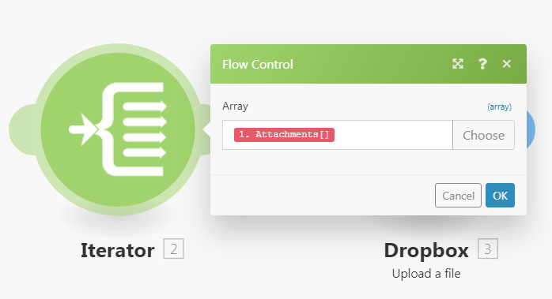
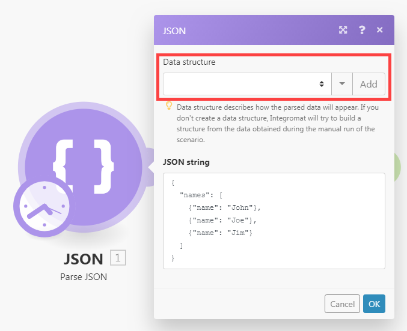

# Módulo [!UICONTROL Iterator]

Um [!UICONTROL Iterator] é um tipo de módulo que converte uma matriz em uma série de pacotes. Cada item de matriz é emitido como um pacote separado.

## Requisitos de acesso

+++ Expanda para visualizar os requisitos de acesso para a funcionalidade neste artigo.

Você deve ter o seguinte acesso para usar a funcionalidade neste artigo:

<table style="table-layout:auto">
 <col> 
 <col> 
 <tbody> 
  <tr> 
    <td role="rowheader">[!DNL Adobe Workfront] pacote</td> 
   <td> 
Qualquer
 </td> 
  </tr> 
  <tr data-mc-conditions=""> 
   <td role="rowheader">[!DNL Adobe Workfront] licença</td> 
   <td> Novo: Padrão
Ou

Atual: trabalho ou superior
 </td> 
  </tr> 
  <tr> 
   <td role="rowheader">[!UICONTROL Adobe Workfront Fusion] licença</td> 
   <td>
   
Atual: nenhum requisito de licença [!DNL Workfront Fusion].

   
Ou

   
Herdados: Qualquer um 

   </td> 
  </tr> 
  <tr> 
   <td role="rowheader">Produto</td> 
   <td>
   
Novo:
 <ul><li>[!UICONTROL Select] ou plano do [!UICONTROL Prime] [!DNL Workfront]: sua organização deve comprar o [!DNL Adobe Workfront Fusion].</li><li>[!UICONTROL Ultimate] [!DNL Workfront] plano: [!DNL Workfront Fusion] está incluído.</li></ul>
   
Ou

   
Atual: sua organização deve comprar o [!DNL Adobe Workfront Fusion].

   </td> 
  </tr>
 </tbody> 
</table>

Para saber que plano, tipo de licença ou acesso você tem, contate o administrador do [!DNL Workfront].

Para obter informações sobre as licenças do Adobe Workfront Fusion, consulte [[!DNL Adobe Workfront Fusion] licenças](/help/workfront-fusion/set-up-and-manage-workfront-fusion/licensing-operations-overview/license-automation-vs-integration.md).

+++

## Configuração do módulo [!UICONTROL Iterator]

O módulo Iterador geral tem um único campo, O campo [!UICONTROL Array]. Este campo contém a matriz a ser convertida ou dividida em pacotes separados.

Outros conectores podem incluir módulos do iterador específicos a esse iterador. Eles contêm um campo do módulo Source, que permite selecionar o módulo que gera a matriz que você deseja iterar.

Para obter mais informações, consulte [Configurar um módulo](/help/workfront-fusion/create-scenarios/add-modules/configure-a-modules-settings.md).

>[!BEGINSHADEBOX]

**Exemplos:**

* O cenário abaixo mostra como recuperar emails com anexos e salvar os anexos como arquivos únicos em uma pasta [!DNL Dropbox] selecionada.

  Os e-mails podem conter uma matriz de anexos. O módulo [!UICONTROL Iterator] após o primeiro módulo permite que o cenário trate cada anexo separadamente. O módulo [!UICONTROL Iterator] divide a matriz de anexos em conjuntos únicos. Cada pacote, com um anexo, é salvo um de cada vez em uma pasta [!DNL Dropbox] selecionada. O campo [!UICONTROL Array] no módulo Iterador deve conter a matriz `Attachments`.

  

>[!ENDSHADEBOX]

## Solução de problemas

### Problema: o painel Mapeamento não exibe itens mapeáveis no módulo [!UICONTROL Iterator]

Quando um módulo [!UICONTROL Iterator] não tem informações sobre a estrutura dos itens da matriz, o painel de mapeamento nos módulos após o módulo [!UICONTROL Iterator] exibe apenas dois itens sob o módulo [!UICONTROL Iterator]: `Total number of bundles` e `Bundle order position`.

Isso ocorre porque cada módulo é responsável por fornecer informações sobre os itens gerados, para que esses itens possam ser exibidos corretamente no painel de mapeamento nos módulos subsequentes. No entanto, em alguns casos, vários módulos podem não ser capazes de fornecer essas informações. Por exemplo, módulos [!UICONTROL JSON] > [!UICONTROL Parse JSON] ou [!UICONTROL Webhooks] > [!UICONTROL Custom Webhook] com estrutura de dados ausente não forneceriam as informações.

#### Solução

A solução é executar o cenário manualmente. Isso força o módulo a criar a saída. O Fusion pode aplicar o formato dessa saída em módulos posteriores no cenário.

Por exemplo, um cenário inclui um módulo [!UICONTROL JSON] > [!UICONTROL Parse JSON] sem uma estrutura de dados.

Um módulo [!UICONTROL Iterator] conectado a este módulo JSON não pode mapear a saída do módulo para o campo Matriz no painel de configuração do módulo [!UICONTROL Iterator].

Para resolver isso:

Iniciar o cenário manualmente no editor de cenários.

>[!NOTE]
>
>Para evitar que todo o cenário seja executado, é possível:
>
>* Desvincule os módulos após o módulo [!UICONTROL JSON] > [!UICONTROL Parse JSON] para impedir que o fluxo continue.
>   Ou
>* Clique com o botão direito do mouse no módulo [!UICONTROL JSON] > [!UICONTROL Parse JSON] e escolha **[!UICONTROL Run this module only]** no menu de contexto para executar apenas o módulo [!UICONTROL JSON] > [!UICONTROL Parse JSON].

Depois que o [!UICONTROL JSON] > [!UICONTROL Parse JSON] for executado, ele poderá fornecer informações sobre suas saídas para todos os módulos subsequentes, incluindo o módulo Iterador. O painel de mapeamento na configuração do Iterador exibe os itens:

além disso, o painel de mapeamento nos módulos conectados após o módulo [!UICONTROL Iterator] exibe os itens contidos na matriz:

