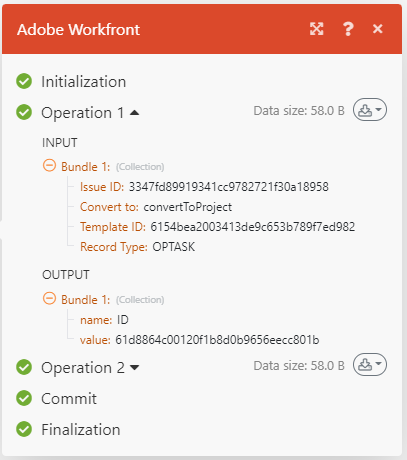

# Fluxo de execução de cenário

Este artigo explica como um cenário é executado, como os dados fluem por ele e como visualizar os dados processados por cada módulo.

## Fluxo de execução de cenário

Depois que um cenário é configurado corretamente e ativado, ele é executado de acordo com seu agendamento definido.

À medida que o cenário começa, o primeiro módulo responde a um evento que foi definido para ser observado. Quando ele retorna dados, esses dados são empacotados em pacotes. O cenário retorna um pacote para cada evento. Por exemplo, se um módulo estiver definido para observar problemas, ele retornará um pacote de dados para cada problema encontrado.

Se o módulo de acionamento retornar algum pacote de dados, esses pacotes passarão para o módulo seguinte e o cenário continuará, passando os pacotes por cada módulo sucessivo, um de cada vez.

Se os pacotes forem processados corretamente por todos os módulos, o cenário será marcado como bem-sucedido na página de detalhes do cenário.

### Exemplo: [!UICONTROL [!DNL Workfront Fusion] for Work Automation]

>[!BEGINSHADEBOX]

**Exemplo:** neste cenário que observa as solicitações recebidas em [!DNL Workfront] e as converte em projetos [!DNL Workfront], os dados fluiriam da seguinte maneira:

O primeiro passo do cenário, executado pelo primeiro módulo, é observar as solicitações. Cada solicitação encontrada é considerada um pacote. Se o módulo for executado sem encontrar nenhum pacote, o cenário terminará após o primeiro módulo.

Se o primeiro módulo retornar um pacote, ele passará pelo restante do cenário. Neste exemplo, o pacote iria para o segundo módulo, que converte a solicitação em um projeto.

>[!ENDSHADEBOX]

### Exemplo: [!UICONTROL [!DNL Workfront Fusion] for Work Automation and Integration]

>[!BEGINSHADEBOX]

**Exemplo:** Neste cenário, que baixa documentos de [!DNL Adobe Workfront] e os envia para uma pasta em [!DNL Dropbox], os dados fluiriam da seguinte maneira:

O primeiro passo do cenário, realizado pelo primeiro módulo, é observar documentos no Workfront. Cada documento encontrado é considerado um pacote. Se o módulo for executado sem encontrar nenhum pacote, o cenário terminará após o primeiro módulo.

Se um pacote for retornado, ele passará pelo restante do cenário. Neste exemplo, o restante do cenário consiste no segundo módulo, que carrega o pacote para a pasta [!DNL Dropbox].

Se o primeiro módulo retornar vários pacotes, o primeiro pacote será carregado para [!DNL Dropbox] antes que o segundo pacote seja carregado. O segundo pacote é carregado, o terceiro e assim por diante.

>[!ENDSHADEBOX]

## Informações sobre pacotes processados

Para cada módulo, o pacote passa por um processo de quatro etapas antes de passar para o próximo módulo ou atingir seu destino final.

* Inicialização
* Operação
* Confirmar/Reverter
* Finalização

>[!NOTE]
>
>O cenário maior passa também por esse processo. Para obter informações sobre esse processo no nível do cenário, consulte [Execução do cenário, ciclos e fases](/help/workfront-fusion/references/scenarios/scenario-execution-cycles-phases.md).

Após a conclusão de uma execução de cenário, cada módulo exibe um ícone mostrando o número de operações realizadas. Você pode clicar nesse ícone para exibir as informações detalhadas sobre os pacotes processados para cada etapa do processo. Você pode ver quais configurações de módulo foram usadas e quais pacotes foram retornados por cada módulo.

Neste exemplo, o módulo recebeu informações de entrada como:

* A ID do problema encontrado
* O objeto para o qual o problema será convertido (Projeto)
* A ID do modelo que ele usará para criar o projeto
* O tipo de registro do objeto encontrado (OPTASK, que é um problema)

Após o processamento, o módulo retornou estas informações de saída:

* ID do projeto recém-criado.

Se o módulo encontrou mais de um problema, as informações são capturadas separadamente para cada pacote. Haveria uma área de Operação 2 com seções de entrada e saída descrevendo o segundo pacote e assim por diante.

## Erros ao executar um cenário

Pode ocorrer um erro durante a execução do cenário. Por exemplo, se você tiver excluído o modelo que o módulo usará para criar o novo projeto, o cenário será encerrado com uma mensagem de erro. Para obter mais informações sobre como lidar com erros, consulte [Tipos de erro](/help/workfront-fusion/references/errors/error-processing.md).

## Recursos

* Para obter mais informações sobre como configurar um cenário, consulte [O editor de cenários](/help/workfront-fusion/get-started-with-fusion/navigate-fusion/scenario-editor.md).
* Para obter mais informações sobre a página de detalhes do cenário, consulte [Detalhes do cenário](/help/workfront-fusion/get-started-with-fusion/navigate-fusion/scenario-details.md).
* Para obter mais informações sobre como ativar um cenário, consulte [Ativar ou desativar um cenário](/help/workfront-fusion/manage-scenarios/activate-deactivate-scenarios.md).
* Para obter mais informações sobre o agendamento de um cenário, consulte [Agendar um cenário](/help/workfront-fusion/create-scenarios/config-scenarios-settings/schedule-a-scenario.md).
* Para obter mais informações sobre módulos, consulte [Visão geral do módulo](/help/workfront-fusion/get-started-with-fusion/understand-fusion/module-overview.md).
