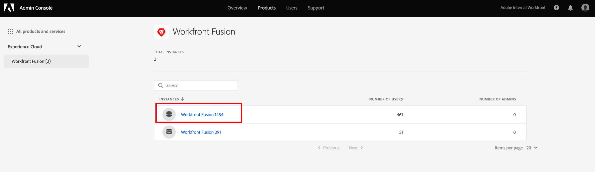

# Adicionar usuários ao Adobe Workfront Fusion por meio da Adobe Admin Console

Você pode adicionar um usuário ao [!DNL Adobe Admin Console] e atribuí-lo a [!DNL Adobe Workfront Fusion], ou atribuir um usuário existente no [!DNL Adobe Admin Console] a [!DNL Workfront Fusion].

Para um vídeo que descreve [!DNL Workfront Fusion] em [!DNL Adobe Admin Console], incluindo como adicionar usuários, consulte [[!DNL Fusion] no Adobe IMS](https://video.tv.adobe.com/v/3412464/){target=_blank}.

Você deve ter o seguinte acesso para usar a funcionalidade neste artigo:

<table style="table-layout:auto"> 
 <col> 
 <col> 
 <tbody> 
  <tr> 
   <td role="rowheader">[!DNL Adobe Workfront] plano*</td> 
   <td> 
[!UICONTROL Pro] ou superior
 </td> 
  </tr> 
  <tr data-mc-conditions=""> 
   <td role="rowheader">[!DNL Adobe Workfront] licença*</td> 
   <td> 
[!UICONTROL Plan], [!UICONTROL Work]
 </td> 
  </tr> 
  <tr> 
   <td role="rowheader">[!DNL Adobe Workfront Fusion] licença**</td> 
   <td>
   
Requisito de licença atual: nenhum requisito de licença [!DNL Workfront Fusion].

   
Ou

   
Requisito de licença herdada: [!UICONTROL [!DNL Workfront Fusion] para Automação e Integração do Trabalho] 

   </td> 
  </tr> 
  <tr> 
   <td role="rowheader">Produto</td> 
   <td>
   
Requisito atual do produto: se você tiver o plano [!UICONTROL Select] ou [!UICONTROL Prime] [!DNL Adobe Workfront], sua organização deve comprar o [!DNL Adobe Workfront Fusion] e o [!DNL Adobe Workfront] para usar a funcionalidade descrita neste artigo. [!DNL Workfront Fusion] está incluído no plano [!UICONTROL Ultimate] [!DNL Workfront].

   
Ou

   
Requisito de produto herdado: sua organização deve comprar o [!DNL Adobe Workfront Fusion] e o [!DNL Adobe Workfront] para usar a funcionalidade descrita neste artigo.

   </td> 
  </tr>
   <tr> 
   <td role="rowheader">[!DNL Adobe] direitos de administrador</td> 
   <td>Você deve ser um [!UICONTROL Product Configuration Administrator] de [!DNL Adobe] produtos para sua organização.</td> 
  </tr>
  </tbody> 
</table>

&#42;Para saber qual plano, tipo de licença ou acesso você tem, contate o administrador do [!DNL Workfront].

&#42;&#42;Para obter informações sobre [!DNL Adobe Workfront Fusion] licenças, consulte [[!DNL Adobe Workfront Fusion] licenças](/help/workfront-fusion/set-up-and-manage-workfront-fusion/licensing-operations-overview/license-automation-vs-integration.md).

## Requisitos de acesso

+++ Expanda para visualizar os requisitos de acesso para a funcionalidade neste artigo.

Você deve ter o seguinte acesso para usar a funcionalidade neste artigo:

<table style="table-layout:auto">
 <col> 
 <col> 
 <tbody> 
  <tr> 
   <td role="rowheader">[!DNL Adobe Workfront] pacote</td> 
   <td> 
Qualquer
 </td> 
  </tr> 
  <tr data-mc-conditions=""> 
   <td role="rowheader">[!DNL Adobe Workfront] licença</td> 
   <td> 
Novo: [!UICONTROL Standard]

Ou

Atual: [!UICONTROL Work] ou superior
 </td> 
  </tr> 
  <tr> 
   <td role="rowheader">[!DNL Adobe Workfront Fusion] licença**</td> 
   <td>
   
Atual: nenhum requisito de licença [!DNL Workfront Fusion].

   
Ou

   
Herdados: Qualquer um 

   </td> 
  </tr> 
  <tr> 
   <td role="rowheader">Produto</td> 
   <td>
   
Novo:
 <ul><li>[!UICONTROL Select] ou plano do [!UICONTROL Prime] [!DNL Workfront]: sua organização deve comprar o [!DNL Adobe Workfront Fusion].</li><li>[!UICONTROL Ultimate] [!DNL Workfront] plano: [!DNL Workfront Fusion] está incluído.</li></ul>
   
Ou

   
Atual: sua organização deve comprar o [!DNL Adobe Workfront Fusion].

   </td> 
  </tr>
  <tr data-mc-conditions=""> 
   <td role="rowheader">Configurações de nível de acesso*</td> 
   <td> 
     
Você deve ser um administrador do [!DNL Workfront Fusion] para sua organização.

     
Você deve ser um administrador [!DNL Workfront Fusion] para sua equipe.

   </td> 
  </tr> 
   </td> 
  </tr> 
 </tbody> 
</table>

Para obter mais detalhes sobre as informações nesta tabela, consulte [Requisitos de acesso na documentação](/help/workfront-fusion/references/licenses-and-roles/access-level-requirements-in-documentation.md).

Para obter informações sobre [!DNL Adobe Workfront Fusion] licenças, consulte [[!DNL Adobe Workfront Fusion] licenças](/help/workfront-fusion/set-up-and-manage-workfront-fusion/licensing-operations-overview/license-automation-vs-integration.md).

+++

## Pré-requisitos

Antes de usar o [!DNL Admin Console] para [!DNL Workfront], você deve receber um email convidando você para o console.

1. Se você é novo no [!DNL Adobe] e recebeu um email informando que agora tem direitos de administrador para gerenciar software e serviços do [!DNL Adobe] para sua organização, clique no botão no email para criar uma conta do [!DNL Adobe] e abrir o [!DNL Admin Console].

   Ou

   Se você já tiver uma conta Adobe, vá para a [[!DNL Adobe Admin Console] página](https://adminconsole.adobe.com).

## Adicionar um novo usuário ao [!DNL Adobe Admin Console] e [!DNL Workfront Fusion]

1. Na [[!DNL Adobe Admin Console] página](https://adminconsole.adobe.com/), selecione a guia **[!UICONTROL Products]** na barra de navegação superior e, em seguida, selecione o bloco de produtos **[!DNL Workfront Fusion]**.

   

1. Na lista exibida, selecione a organização à qual deseja adicionar um usuário.

   

1. Na lista exibida, com a guia **[!UICONTROL Product Profiles]** selecionada, clique no nome do link [!DNL Workfront Fusion] [!UICONTROL Product Profile].

   >[!IMPORTANT]
   >
   > Não faça nenhuma alteração no próprio [!UICONTROL Product Profile].

1. Com a guia **[!UICONTROL Users]** selecionada acima da lista, clique em **[!UICONTROL Add User]**.

1. Na caixa **[!UICONTROL Add users to this product profile]**, digite o endereço de email ou o nome de um usuário que deseja adicionar e selecione o usuário na lista exibida.

1. Clique em **[!UICONTROL Save]**.

   O usuário foi criado em [!DNL Workfront Fusion].

1. (Opcional) Continue para [Alterar o nível de acesso de um usuário em [!DNL Workfront Fusion]](#change-a-users-access-level-in-workfront-fusion)

## Alterar o nível de acesso de um usuário no Workfront Fusion

* [Alterar a função de um usuário para Administrador](#change-a-users-role-to-admin)
* [Alterar a função de um usuário para Membro, Contador ou Desenvolvedor de aplicativos](#change-a-users-role-to-member-accountant-or-app-developer)

### Alterar a função de um usuário para Administrador

A atribuição de uma função de Administrador a um usuário deve ser feita no [!DNL Adobe Admin Console].

1. Na página [!DNL Workfront Fusion] [!UICONTROL Product Profile] em que você adicionou o usuário, selecione a guia **[!UICONTROL Admins]**.

1. Clique em **[!UICONTROL Add Admin]**.

1. Na caixa **[!UICONTROL Add product profile administrators]**, digite o endereço de email ou o nome do usuário que deseja tornar-se um administrador e selecione o usuário na lista exibida.

1. Clique em **[!UICONTROL Save]**.

   O usuário agora é um Administrador em [!DNL Workfront Fusion].

### Alterar a função de um usuário para Membro, Contador ou Desenvolvedor de aplicativos

As funções de Membro, Contador e Desenvolvedor de aplicativos são tratadas no Workfront Fusion.

Para obter instruções, consulte [Exibir ou editar funções de usuário](/help/workfront-fusion/set-up-and-manage-workfront-fusion/set-up-and-manage-orgs-and-teams/manage-users-and-teams/view-or-edit-user-roles.md).

## Atribuir um usuário existente no [!DNL Adobe Admin Console] a [!DNL Workfront Fusion]

É possível adicionar um usuário existente a uma equipe no Fusion. Isso é tratado no Fusion.

Para obter instruções, consulte [Adicionar um usuário a uma equipe](/help/workfront-fusion/set-up-and-manage-workfront-fusion/set-up-and-manage-orgs-and-teams/set-up-orgs-teams-and-users/add-a-user-to-a-team.md).
